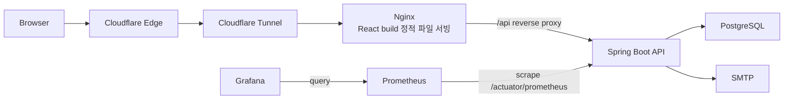

# Task Reloader

완료 시점을 기준으로 반복 작업의 다음 일정을 재계산하고, 오늘 할 일·완료 이력·위험 작업을 관리하는 개인 Task 서비스입니다.

```text
next_due_at = completed_at + every_n_days
```

Spring Boot, PostgreSQL, React 기반으로 핵심 기능을 구현하고, 홈서버에 Docker Compose로 배포했습니다. Cloudflare Tunnel로 직접 포트 노출 없이 외부 접근을 구성했으며, Prometheus/Grafana/k6를 활용해 부하테스트, 병목 분석, 장애 원인 추적까지 수행했습니다.

## Live Demo

- 서비스 URL: [https://task.dawnpoem.kr](https://task.dawnpoem.kr)
- 포트폴리오 방문자는 로그인 화면의 `데모 계정으로 빠르게 체험하기` 버튼으로 바로 체험할 수 있습니다.
- 일반 가입자는 회원가입 후 관리자 승인 완료 시 사용 가능합니다.
- 관리자/운영 도구는 공개 도메인과 분리해 접근 제어합니다.

## 핵심 성과

- 홈서버에 Docker Compose 기반 운영 환경 구성
- Cloudflare Tunnel을 활용해 직접 포트 노출 없이 외부 호스팅
- Cloudflare Access/도메인 분리로 관리자/운영 도구 접근 제어
- Prometheus/Grafana로 request count, latency, 5xx endpoint 관측
- k6 read/mixed/soak 부하테스트 수행
- 로그인 병목과 인증 부하 변수를 API 본체 부하와 분리
- JPA lazy loading 중 연결 Task 삭제로 발생한 read/write 경합성 500 오류를 DTO projection 조회로 해결
- 수정 후 fixed-token mixed/soak 재검증에서 실패율 `0%`, checks `100%` 확인

## Why I Built This

고정 요일/날짜 중심 반복 일정은 실제 완료 시점과 쉽게 어긋납니다. “3일마다” 해야 하는 작업을 2일 늦게 완료했다면, 다음 일정도 실제 완료 시점 기준으로 다시 잡히는 편이 사용자 경험에 더 가깝습니다.

Task Reloader는 이 문제를 `completed_at` 중심의 반복 모델로 풀고, 오늘 할 일, 완료 이력, 인사이트, 이메일 알림을 통해 사용자가 자신의 반복 작업 흐름을 운영할 수 있게 만드는 데 초점을 맞췄습니다.

## Key Features

- `DUE_NOW`: `OVERDUE + TODAY`를 묶어 지금 해야 할 작업을 우선 노출
- 완료 처리: 완료 시 현재 시각 기준으로 `next_due_at` 재계산
- 완료 이력: 월별 캘린더와 날짜별 완료 기록 조회
- 인사이트: 오늘 완료, 7일 이상 지연, 30일 무완료, 완료/지연 Top 추세
- 멀티유저: 회원가입, 관리자 승인, `USER/ADMIN` 역할, 사용자별 Task 범위 분리
- 인증/보안: access token, HttpOnly refresh cookie 회전, CSRF 보호, rate-limit, 계정 잠금
- 이메일 알림: 사용자별 설정, 수신자 관리, 스케줄러 발송, 최근 발송 결과 추적
- 운영 관측성: requestId, access log, health, metrics, Prometheus, Grafana

## Architecture



운영 아키텍처와 요청 흐름은 [docs/architecture.md](docs/architecture.md)에서 자세히 확인할 수 있습니다.

## What I Focused On

| 주제 | 선택 | 이유 |
|------|------|------|
| 상태 모델 | 저장형 상태 대신 `next_due_at` 계산 | 날짜 경계 변경 시 상태 불일치/배치 동기화 비용 제거 |
| 완료 처리 | row lock + 2초 쿨다운 | 더블클릭/동시 요청에서 이력 중복과 상태 꼬임 방어 |
| 인증/승인 | access token + HttpOnly refresh cookie + 관리자 승인 | 공개 데모와 실제 가입 흐름을 함께 보호 |
| 인사이트 조회 | DTO projection 기반 조회 | lazy loading/N+1 리스크와 read/write 경합성 500 완화 |

전체 설계 결정과 trade-off는 [docs/design-decisions.md](docs/design-decisions.md)에 정리했습니다.

## Troubleshooting / Performance

부하테스트는 최대 RPS만 측정하는 방식이 아니라, 문제를 분리하고 코드 수정 후 재검증하는 흐름으로 진행했습니다.

| 단계 | 목적 | 결과 |
|------|------|------|
| Read Matrix | Read API 기준선 확인 | `80 VU`, `553.22 RPS`, p95 `8.11ms`, 실패율 `0%` |
| Mixed Peak | read/write 혼합 부하 확인 | 인증 `401/429`와 `recent-completions` 500 발견 |
| Fixed Token Mixed | 인증 변수 제거 후 API 본체 검증 | 실패율이 `0.0243%`로 축소, 남은 실패가 `recent-completions` 500으로 집중 |
| Projection 수정 후 재검증 | lazy loading 경합 제거 확인 | `972,932` req, `463.20 RPS`, 실패율 `0%` |
| Fixed Token Soak | 장시간 안정성 확인 | `60 VU`, `2h`, `3,507,776` req, 실패율 `0%` |

가장 중요한 장애 개선 사례는 `GET /api/insights/recent-completions`에서 발생한 500입니다. 완료 이력 조회 중 연결된 Task가 삭제되면서 lazy loading 시점에 `EntityNotFoundException`이 발생했고, DTO projection 조회로 삭제된 엔티티 참조에 의존하지 않도록 수정했습니다.

- 상세 부하테스트 흐름: [docs/load-testing-summary.md](docs/load-testing-summary.md)
- 500 원인 분석과 수정: [docs/troubleshooting/recent-completions-500.md](docs/troubleshooting/recent-completions-500.md)

## Tech Stack

- Backend: Java 17, Spring Boot, Spring Security, Spring Data JPA, Flyway
- Database: PostgreSQL
- Frontend: React, TypeScript, Vite
- Infra/Observability: Docker Compose, Cloudflare Tunnel, Spring Actuator, Micrometer, Prometheus, Grafana
- Test/Quality: JUnit5, Mockito, Testcontainers, ESLint, TypeScript type-check, k6

## Run Locally

운영 실행, `.env` 설정, Cloudflare Tunnel, 운영 보안 체크리스트는 [infra/README.md](infra/README.md)를 기준으로 합니다.

빠른 시작:

```sh
cp infra/.env.example infra/.env
cd infra
docker compose up -d --build
```

개발 실행:

```sh
# DB
cd infra
docker compose up -d postgres

# API
./gradlew :apps:api:bootRun --args='--spring.profiles.active=local'

# Web
cd apps/web
npm install
npm run dev
```

- Web: `http://localhost:5173`
- API: `http://localhost:8080`
- Swagger: `http://localhost:8080/swagger-ui/index.html`

## Documentation

- [Architecture](docs/architecture.md): Cloudflare Tunnel, Nginx, API, DB, Prometheus/Grafana 운영 구조
- [Auth & Refresh Token](docs/auth-refresh-token.md): access token, HttpOnly refresh cookie, rotation, CSRF 보호 흐름
- [API Reference](docs/api.md): 인증, Task, 인사이트, 이메일 알림, 관리자 API와 지표 정의
- [Design Decisions](docs/design-decisions.md): 상태 모델, 완료 처리, 인증/승인, 알림, 인사이트 조회 등 trade-off
- [Load Testing Summary](docs/load-testing-summary.md): read/mixed/soak 부하테스트 전체 흐름과 결과
- [recent-completions 500](docs/troubleshooting/recent-completions-500.md): lazy loading + 삭제 경합 문제 분석과 수정
