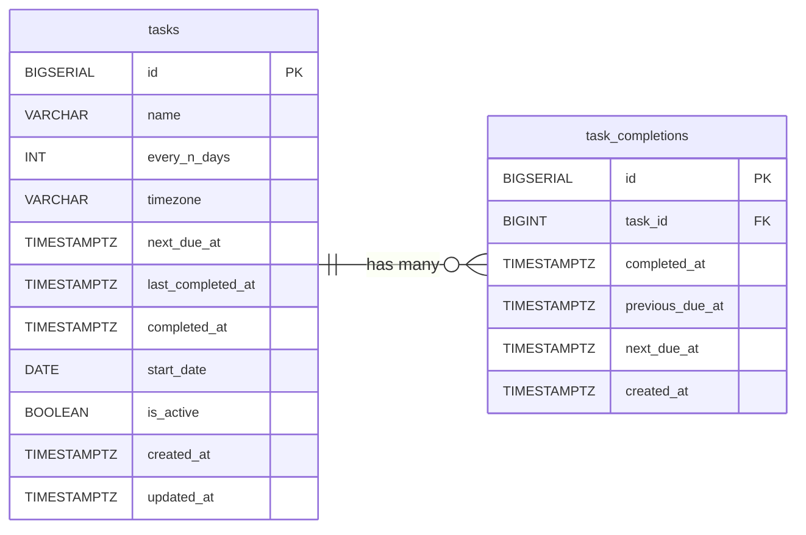
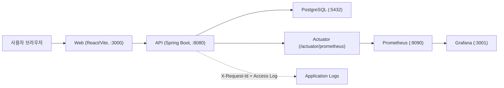

# Task Reloader 프로젝트 소개서

문서 버전: v1.0  
프로젝트 기간: 2026-03 (MVP) ~ 진행 중  
저장소: `task-reloader`  
GitHub: [dawnpoems/task-reloader](https://github.com/dawnpoems/task-reloader)  

---

## 1. 프로젝트 한 줄 소개

**Task Reloader는 “완료한 시점”을 기준으로 다음 일정을 다시 계산하는 반복 작업 관리 서비스입니다.**

일반적인 캘린더형 반복 일정은 “매주 화요일”, “매월 1일”처럼 고정 날짜 중심이라 실제 완료 시점과 어긋나기 쉽습니다.  
이 프로젝트는 아래 공식을 중심으로, 사용자가 실제 행동한 시점을 일정의 기준으로 삼습니다.

```text
next_due_at = completed_at + every_n_days
```

---

## 2. 문제 정의와 해결 방식

### 문제 정의

1. 고정형 반복 일정은 실제 생활 리듬을 반영하지 못해 신뢰도가 떨어진다.
2. “오늘 해야 할 일”과 “나중에 할 일”이 섞이면 사용자가 우선순위를 다시 계산해야 한다.
3. 마지막 완료 시점만 저장하면, 장기 패턴(지연 습관, 월별 흐름)을 읽기 어렵다.
4. 서비스가 동작하더라도 요청 추적/성능 관측이 없으면 운영 단계에서 장애 대응이 느려진다.

### 해결 방식

1. 완료 시점 기반 일정 모델로 전환 (`completed_at` 중심).
2. 메인 화면을 `DUE_NOW` 중심으로 설계해 즉시 실행할 항목을 먼저 노출.
3. 완료 이벤트를 `task_completions`에 누적 저장해 월/일 단위 이력 분석 가능.
4. `X-Request-Id`, Metrics, Prometheus, Grafana를 포함해 운영 가능한 형태로 구성.

---

## 3. 핵심 성과 요약

| 구분 | 내용 |
|---|---|
| 도메인 모델 | 상태 저장형 대신 계산형(`next_due_at` 기준 `OVERDUE/TODAY/UPCOMING`) |
| 동시성 안정성 | `findByIdForUpdate` row lock + 2초 쿨다운으로 중복 완료 방지 |
| 데이터 확장성 | `task_completions` 누적 테이블 도입으로 인사이트 확장 기반 확보 |
| 사용자 경험 | 모달 포커스 트랩, Esc 닫기, 처리중/재시도/에러 분리 제공 |
| 운영 관측성 | requestId 연계 access log + `/actuator/prometheus` + Grafana 대시보드 |
| 성능 검증 | k6 50 VUs / 5분 테스트에서 실패율 0%, p95 20ms 내외 |

---

## 4. 기술 스택

- Backend: Java 17, Spring Boot, Spring Data JPA, Flyway, PostgreSQL
- Frontend: React, TypeScript, Vite
- Infra: Docker Compose
- Observability: Spring Actuator, Micrometer, Prometheus, Grafana
- Quality: JUnit5, Mockito, Testcontainers, ESLint, TypeScript type-check

## 5. 제품 관점 설계

### 5.1 사용자 시나리오

1. 사용자는 반복 Task(예: 영양제 복용, 운동, 정리 루틴)를 생성한다.
2. 메인 화면에서 `DUE_NOW` 목록을 확인한다.
3. 완료 버튼을 누르면 현재 시각을 기준으로 다음 예정일이 재계산된다.
4. 상세 화면에서 월별 캘린더와 날짜별 완료 이력을 확인한다.

### 5.2 왜 “완료 시점 기준”이 중요한가

- “3일마다” 작업을 2일 늦게 완료했다면, 다음 일정도 그 완료 시점 기준으로 밀리는 것이 현실적이다.
- 사용자 입장에서는 “내가 실제로 언제 했는지”와 앱이 보여주는 일정이 일치해야 서비스 신뢰도가 올라간다.
- 따라서 Task Reloader는 “달력 고정 규칙”보다 “행동 기반 규칙”을 우선한다.

### 5.3 기능 구성

1. Task CRUD
2. 완료 처리 API (`POST /api/tasks/{id}/complete`)
3. 상태 필터 (`DUE_NOW`, `UPCOMING`)
4. 상세 페이지 월별 완료 이력 조회
5. 인사이트 API (`/api/insights/dashboard`, `/overview`, `/recent-completions`)

---

## 6. API/도메인 구조 핵심

### 6.1 주요 엔드포인트

| Method | Path | 설명 |
|---|---|---|
| GET | `/api/tasks?status=DUE_NOW` | 지금 해야 할 작업 조회 (`OVERDUE + TODAY`) |
| GET | `/api/tasks?status=UPCOMING` | 이후 예정 작업 조회 |
| POST | `/api/tasks` | 작업 생성 |
| PATCH | `/api/tasks/{id}` | 작업 수정 |
| POST | `/api/tasks/{id}/complete` | 완료 처리 및 다음 일정 갱신 |
| GET | `/api/tasks/{id}/completions?year=YYYY&month=MM` | 월별 완료 이력 |
| GET | `/api/insights/overview?days=30&top=5` | 완료율/지연률/리스크/트렌드 |

### 6.2 상태 판정 규칙

`TaskStatusResolver`에서 `next_due_at`을 KST 기준 하루 경계와 비교해 판정:

- `next_due_at < todayStart` -> `OVERDUE`
- `next_due_at < tomorrowStart` -> `TODAY`
- 그 외 -> `UPCOMING`

### 6.3 데이터 모델

`tasks`
- 반복 작업의 현재 상태(다음 예정일, 최근 완료일, 활성 여부) 보관

`task_completions`
- 완료 이벤트 이력(완료 시각, 이전 예정일, 다음 예정일) 누적 저장
- 월별 조회/통계/감사 추적/패턴 분석의 기반

### 6.4 ERD



## 7. 시스템 아키텍처 및 운영 구성

### 7.1 실행 아키텍처



Docker Compose 기반으로 `web + api + db + prometheus + grafana`를 한 번에 기동할 수 있다.

### 7.2 운영 추적 포인트

1. 요청 단위 추적: `X-Request-Id` 생성/전파
2. access log: method, uri, status, durationMs, requestId
3. health/readiness/liveness: `/actuator/health`, `/healthz`
4. 지표 수집: `http.server.requests` 기반 RPS/에러율/Latency
5. 대시보드: 요청량, 5xx, p95, 느린 API Top5, 5xx Endpoint Top5

### 7.3 이벤트 기반 로깅 분리

- 서비스 로직에서 `TaskCreated/Updated/Deleted/Completed` 이벤트 발행
- `TaskEventLogListener`에서 `AFTER_COMMIT` 시점에 운영 로그 기록
- 효과: 도메인 처리와 운영 관심사를 분리해 유지보수성과 확장성 강화

---

## 8. 예외/실패 흐름 설계

1. 비활성 Task 완료 요청 -> `TASK_INACTIVE`
2. 짧은 시간 중복 완료 요청 -> `TASK_RECENTLY_COMPLETED`
3. 모든 에러 응답에 `requestId` 포함
4. 프론트에서 전역 에러/로컬 에러를 분리 노출
5. 실패 시 재시도 동선을 명확히 제공

### 8.1 사용자 경험 품질 포인트

- 모달 접근성: `role="dialog"`, `aria-modal`, Esc 닫기, Tab 포커스 트랩, 닫힘 후 포커스 복귀
- 버튼 상태: 처리 중 텍스트(`처리 중...`), 중복 클릭 방지(disabled)
- 상세 페이지: API 실패 시 재시도 UI 제공

## 9. 성능/품질 검증

### 9.1 테스트 전략

1. 단위 테스트: `TaskService`, `TaskStatusResolver` 중심의 도메인 규칙 검증
2. 저장소/컨트롤러 테스트: 쿼리/요청 스펙 회귀 방지
3. 로컬 품질 게이트: type-check, test, build, lint 루틴 고정

### 9.2 k6 부하 테스트 결과 (실측)

실행 일시: **2026-03-30** (KST)

#### Read Suite (10 VUs, 1분)

- HTTP requests: 4,060 (67.36 req/s)
- 실패율: 0.00%
- checks: 100.00%
- 전체 응답시간: avg 5.34ms / p95 11.92ms

#### Extended Read Suite (50 VUs, 5분)

- HTTP requests: 103,292 (329.36 req/s)
- 실패율: 0.00%
- checks: 100.00%
- 전체 응답시간: avg 7.71ms / p95 18.60ms
- 결론: 설정한 SLO 범위 내에서 안정적으로 동작

### 9.3 엔드포인트 p95 (50 VUs 기준, ms)

| API | p95(ms) | 목표 | 결과 |
|---|---:|---:|---|
| `GET /api/tasks?status=DUE_NOW` | 20.15 | < 800 | PASS |
| `GET /api/tasks?status=UPCOMING` | 19.64 | < 800 | PASS |
| `GET /api/insights/dashboard` | 20.22 | < 1000 | PASS |
| `GET /api/insights/overview` | 20.10 | < 1000 | PASS |
| `GET /api/insights/recent-completions` | 20.44 | < 1000 | PASS |


---

## 10. 기술 선택 근거 (Trade-off)

1. 상태를 DB에 저장하지 않고 계산형으로 유지
- 장점: 상태 불일치/동기화 비용 축소
- 단점: 조회 시 계산 비용 증가

2. row lock + 쿨다운 방어
- 장점: 더블클릭/동시 요청에서도 데이터 신뢰성 보장
- 단점: 구현 복잡도 증가

3. 이력 누적 저장
- 장점: 인사이트/통계/감사 로그 확장성 확보
- 단점: 저장량 증가

4. 관측성 기본 내장
- 장점: 운영 단계의 원인 추적 속도 향상
- 단점: 초기 설정 비용 증가

## 11. 향후 확장 계획 (설계 포함)

1. 멀티유저/권한 모델 도입 (개인/팀 분리)
2. 알림 시스템 MVP (이메일/메신저)
3. Grafana Alerting 고도화 (임계치/재알림/소음 제어)
4. Cloudflare Tunnel 기반 외부 테스트 환경
5. 인사이트 고도화 (트렌드 비교, 예측 지표)
6. Grace Window 정책 도입 (과도한 overdue 판정 완화)
