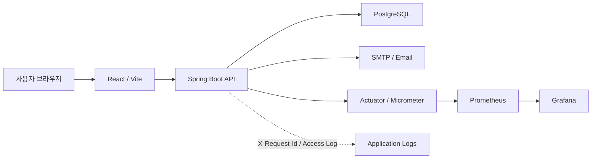
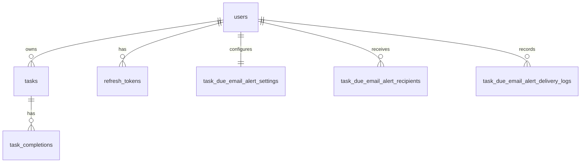
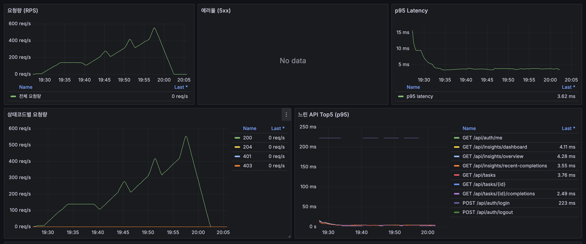

# Task Reloader 프로젝트 기술 소개서

| 항목 | 내용 |
|------|------|
| 프로젝트명 | Task Reloader |
| 한 줄 소개 | 완료한 시점을 기준으로 다음 일정을 다시 계산하는 반복 작업 관리 서비스 |
| 프로젝트 기간 | 2026-03 MVP ~ 진행 중 |
| 담당 범위 | 제품 기획, 백엔드, 프론트엔드, 인증/보안, 인프라, 관측성, 부하테스트 |
| 주요 기술 | Java 17, Spring Boot, PostgreSQL, React, TypeScript, Docker Compose, Prometheus, Grafana, k6 |
| 라이브 데모 | https://task.dawnpoem.kr |
| 저장소 | https://github.com/dawnpoems/task-reloader |

---

## 1. 프로젝트 개요

Task Reloader는 반복 작업의 다음 예정일을 고정 날짜가 아니라 사용자가 실제로 완료한 시점에서 다시 계산하는 서비스입니다.

```text
next_due_at = completed_at + every_n_days
```

예를 들어 “3일마다 운동”이라는 작업을 2일 늦게 완료했다면, 다음 일정도 실제 완료 시점 기준으로 다시 잡히는 것이 자연스럽습니다. 이 프로젝트는 그런 생활 리듬을 제품 모델에 반영하고, 완료 이력, 인사이트, 이메일 알림, 운영 관측성을 붙여 실제 공개 데모 서비스로 운영할 수 있는 형태까지 확장한 개인 프로젝트입니다.

### 핵심 성과

| 구분 | 결과 |
|------|------|
| 일정 모델 | `next_due_at` 기반 계산형 상태 모델로 `OVERDUE/TODAY/UPCOMING` 판정 |
| 사용자 흐름 | `DUE_NOW` 중심 홈 화면, 상세 화면의 월별/날짜별 완료 이력 |
| 멀티유저 | 회원가입, 관리자 승인, `USER/ADMIN` 역할, 사용자별 데이터 범위 분리 |
| 인증/보안 | access token, HttpOnly refresh cookie 회전, CSRF 보호, rate-limit, 계정 잠금 |
| 인사이트 | 오늘 완료, 7일 이상 지연, 30일 무완료, 완료/지연 Top 추세 |
| 알림 | 작업 마감 이메일 알림 설정, 수신자 관리, 스케줄러 발송, 발송 로그 |
| 운영 | requestId, access log, Actuator, Prometheus, Grafana, k6 부하테스트 |
| 검증 | fixed-token mixed/soak 재검증에서 실패율 `0%`, checks `100%` 확인 |

---

## 2. 문제 정의와 목표

### 사용자 문제

1. 고정 반복 일정은 실제 완료 시점이 늦어져도 다음 일정이 비현실적으로 유지됩니다.
2. 오늘 해야 할 일과 나중에 할 일이 섞이면 사용자가 매번 우선순위를 다시 계산해야 합니다.
3. 마지막 완료일만 저장하면 어떤 작업이 계속 밀리는지, 어떤 작업은 더 이상 필요 없는지 판단하기 어렵습니다.
4. 앱을 열지 않으면 오늘 처리할 일을 놓칠 수 있습니다.

### 기술/운영 문제

1. 공개 데모 서비스에서 가입을 열어두려면 관리자 승인과 권한 분리가 필요합니다.
2. 인증 실패, token 만료, rate-limit가 섞이면 API 본체의 안정성을 따로 판단하기 어렵습니다.
3. 500이 발생해도 requestId, endpoint, stack trace가 연결되지 않으면 원인 분석이 늦어집니다.
4. “로컬에서 동작한다” 수준을 넘어 운영 가능한 서비스라는 근거가 필요합니다.

### 프로젝트 목표

- 완료 시점 기반 반복 일정이라는 제품 핵심 모델을 안정적으로 구현합니다.
- 사용자가 지금 해야 할 일, 이미 한 일, 정리해야 할 일을 빠르게 구분하도록 화면과 API를 설계합니다.
- 공개 데모 운영에 필요한 인증, 승인, 알림, 관측성, 부하 검증을 함께 갖춥니다.

---

## 3. 주요 기능

### 3.1 반복 Task 관리

- Task 생성, 수정, 삭제
- 시작일과 반복 주기(`every_n_days`) 기반 `next_due_at` 계산
- 완료 시 현재 시각 기준으로 다음 예정일 재계산
- 비활성 Task 완료 방지
- 2초 내 중복 완료 요청 방지

### 3.2 오늘 할 일 중심 화면

- `DUE_NOW = OVERDUE + TODAY`
- 홈 화면에서 지금 처리해야 할 작업을 우선 노출
- 예정된 작업(`UPCOMING`)은 펼칠 때 지연 조회
- Task 상세 화면에서 월별 캘린더와 날짜별 완료 이력 확인

### 3.3 인사이트

- 오늘 완료한 작업과 밀린 작업 해소 여부
- 7일 이상 지연된 위험 작업
- 30일 동안 완료 이력이 없는 방치 작업
- 완료 건수, 지연 건수, 지연률 기준 Top N

### 3.4 인증과 관리자 승인

- 일반 사용자는 회원가입 후 `PENDING` 상태로 시작
- 관리자가 승인해야 서비스 화면 접근 가능
- `USER/ADMIN` 역할 분리
- access token + HttpOnly refresh cookie 회전
- CSRF cookie/header 기반 refresh/logout 보호
- 로그인 rate-limit와 계정 잠금 정책

### 3.5 이메일 알림

- 사용자별 이메일 알림 활성화 여부, 발송 시각, timezone 설정
- 수신자 목록 관리
- 스케줄러 기반 발송
- 발송 성공/실패 로그 기록
- 로컬 프로필에서 즉시 발송 API로 템플릿과 발송 흐름 검증

---

## 4. 시스템 구성


```mermaid
flowchart LR
    User["사용자 브라우저"] --> Web["React / Vite"]
    Web --> Api["Spring Boot API"]
    Api --> Db["PostgreSQL"]
    Api --> Mail["SMTP / Email"]
    Api --> Metrics["Actuator / Micrometer"]
    Metrics --> Prom["Prometheus"]
    Prom --> Grafana["Grafana"]
    Api -. "X-Request-Id / Access Log" .-> Logs["Application Logs"]
```

운영 구성은 Docker Compose를 기준으로 `web`, `api`, `postgres`, `prometheus`, `grafana`를 함께 실행할 수 있게 만들었습니다. 공개 데모는 Cloudflare Tunnel을 통해 외부에 노출하고, 관리자/운영 도구는 공개 사용자 동선과 분리했습니다.

### 기술 스택

| 영역 | 사용 기술 |
|------|-----------|
| Backend | Java 17, Spring Boot, Spring Security, Spring Data JPA, Flyway |
| Database | PostgreSQL |
| Frontend | React, TypeScript, Vite |
| Infra | Docker Compose, Cloudflare Tunnel |
| Observability | Spring Actuator, Micrometer, Prometheus, Grafana |
| Test/Quality | JUnit5, Mockito, Testcontainers, ESLint, TypeScript type-check, k6 |

---

## 5. 도메인 모델


```mermaid
erDiagram
    users ||--o{ tasks : owns
    users ||--o{ refresh_tokens : has
    tasks ||--o{ task_completions : has
    users ||--|| task_due_email_alert_settings : configures
    users ||--o{ task_due_email_alert_recipients : receives
    users ||--o{ task_due_email_alert_delivery_logs : records
```

| 테이블 | 역할 |
|--------|------|
| `users` | 이메일, 비밀번호 해시, 역할, 승인 상태, 로그인 실패/잠금 상태 |
| `refresh_tokens` | refresh token hash, 만료 시각, 폐기 시각, 마지막 사용 시각 |
| `tasks` | 현재 반복 작업 상태, 다음 예정일, 마지막 완료일, 활성 여부 |
| `task_completions` | 완료 이벤트 이력, 완료 시각, 이전 예정일, 다음 예정일 |
| `task_due_email_alert_settings` | 사용자별 이메일 알림 설정과 다음 발송 스케줄 |
| `task_due_email_alert_recipients` | 이메일 알림 수신자 목록 |
| `task_due_email_alert_delivery_logs` | 발송 일자, 상태, 시도 횟수, 수신자 수, 실패 메시지 |

핵심은 `tasks`와 `task_completions`를 분리한 점입니다. `tasks`는 현재 상태를 빠르게 보여주기 위한 테이블이고, `task_completions`는 과거 완료 이벤트를 누적해 이력, 인사이트, 감사 추적의 기반이 됩니다.

---

## 6. API 설계 요약

Base URL은 `/api`입니다. 일반 API는 bearer access token이 필요하고, 관리자 API는 `ADMIN` 역할이 필요합니다.

| 영역 | Method | Endpoint | 설명 |
|------|--------|----------|------|
| Auth | `POST` | `/auth/signup` | 회원가입, 신규 사용자는 `PENDING` |
| Auth | `POST` | `/auth/login` | access token 발급, refresh/CSRF cookie 설정 |
| Auth | `POST` | `/auth/refresh` | refresh token 회전, access token 재발급 |
| Auth | `GET` | `/auth/me` | 현재 사용자 정보 조회 |
| Task | `GET` | `/tasks?status=DUE_NOW` | 지금 해야 할 작업 조회 |
| Task | `GET` | `/tasks?status=OVERDUE` | 상태별 조회. `TODAY`, `UPCOMING`도 지원 |
| Task | `POST` | `/tasks` | 반복 Task 생성 |
| Task | `PATCH` | `/tasks/{id}` | 반복 Task 수정 |
| Task | `POST` | `/tasks/{id}/complete` | 완료 처리와 다음 일정 갱신 |
| Task | `GET` | `/tasks/{id}/completions` | 완료 이력 조회 |
| Insights | `GET` | `/insights/dashboard` | 전체/기한초과/오늘/예정/완료 요약 |
| Insights | `GET` | `/insights/overview?days=30&top=5` | 완료율, 지연률, 위험 작업, Top 추세 |
| Alerts | `GET` | `/alerts/task-due-email/settings` | 이메일 알림 설정 조회 |
| Alerts | `PATCH` | `/alerts/task-due-email/settings` | 이메일 알림 설정 수정 |
| Alerts | `POST` | `/alerts/task-due-email/recipients` | 이메일 알림 수신자 추가 |
| Admin | `GET` | `/admin/users/pending` | 승인 대기 사용자 조회 |
| Admin | `POST` | `/admin/users/{userId}/approve` | 사용자 승인 |

---

## 7. 핵심 설계 결정

| 결정 | 선택 | 이유 | 트레이드오프 |
|------|------|------|--------------|
| 상태 모델 | `next_due_at` 기반 계산형 상태 | 날짜 경계 변경 시 상태 불일치 제거 | 조회 시 계산 비용 발생 |
| 완료 처리 | row lock + 2초 쿨다운 | 더블클릭/동시 요청에서 이력 중복 방어 | 구현 복잡도 증가 |
| 완료 이력 | `task_completions` 누적 저장 | 월별 이력, 인사이트, 감사 추적 확장 | 저장량과 조회 쿼리 증가 |
| 인증 | access token + HttpOnly refresh cookie 회전 | 브라우저 UX와 refresh token 보호 균형 | 클라이언트 인증 상태 관리 복잡도 증가 |
| 승인 흐름 | 일반 가입은 `PENDING`, 관리자가 승인 | 공개 데모와 운영 보호 동시 달성 | 관리자 운영 화면 필요 |
| 알림 | 설정/수신자/스케줄러/로그 분리 | 중복 발송과 실패 추적 가능 | 메일/스케줄러 운영 비용 증가 |
| 인사이트 조회 | projection 기반 요청 시 계산 | lazy loading/N+1 리스크 완화 | 데이터 증가 시 캐시/요약 테이블 필요 |
| 로깅 | 도메인 이벤트 + `AFTER_COMMIT` 리스너 | 비즈니스 로직과 운영 로그 관심사 분리 | 이벤트/리스너 관리 비용 발생 |

---

## 8. 인사이트 지표 설계

### Dashboard

| 필드 | 의미 |
|------|------|
| `totalTasks` | 현재 사용자의 활성 Task 수 |
| `overdueTasks` | KST 오늘 시작보다 `next_due_at`이 이전인 Task 수 |
| `todayTasks` | KST 오늘 범위에 `next_due_at`이 포함된 Task 수 |
| `upcomingTasks` | KST 내일 시작 이후 예정된 Task 수 |
| `completedToday` | KST 오늘 완료한 이력 수 |
| `completedLast7Days` | 현재 시각 기준 최근 7일 완료 이력 수 |

### Overview

`GET /api/insights/overview?days=30&top=5`

| 지표 | 계산 기준 |
|------|-----------|
| 기간 | `periodStart <= completed_at < periodEnd` |
| 완료율 | `completedTaskCount / activeTaskCount * 100` |
| 지연률 | `delayedCompletionCount / completionCount * 100` |
| 평균 지연일 | 지연 완료 건의 `completed_at - previous_due_at` 평균 |
| 위험 작업 | `OVERDUE_7D_PLUS`, `NO_COMPLETION_30D` |
| Top 추세 | 완료 건수, 지연 완료 건수, 지연률 기준 Top N |

---

## 9. 운영 관측성

운영 단계에서 “무슨 요청이 실패했는지”를 바로 추적할 수 있도록 요청 단위 관측성을 먼저 넣었습니다.

| 항목 | 내용 |
|------|------|
| Request ID | `X-Request-Id` 생성/전파, 에러 응답과 로그에 연결 |
| Access Log | method, uri, status, durationMs, requestId 기록 |
| Health | `/healthz`, `/actuator/health` |
| Metrics | `/actuator/metrics`, `/actuator/prometheus` |
| Grafana | 요청량, 오류율, p95, endpoint Top5, 5xx endpoint Top5 |
| 부하테스트 로그 | 테스트 종료 후 API/DB 로그, 5xx trace, exception summary 저장 |

이 구성 덕분에 부하테스트에서 500이 발생했을 때 Grafana의 endpoint 지표에서 requestId와 stack trace까지 연결해 원인을 확인할 수 있었습니다.

---

## 10. 부하테스트와 장애 개선 사례

이 프로젝트에서 가장 의미 있었던 검증은 최대 RPS를 측정한 것이 아니라, 실패를 발견하고 코드를 고친 뒤 같은 조건과 더 긴 조건에서 다시 검증한 과정입니다.

### 10.1 테스트 흐름

| 단계 | 목적 | 핵심 결과 |
|------|------|----------|
| Read Matrix | read API 기준선 확인 | `80 VU`, 평균 `553.22 RPS`, p95 `8.11ms`, 실패율 `0%` |
| Mixed Peak | read/write 혼합 병목 확인 | 평균 `415.59 RPS`, `401/429` 대량 발생, `recent-completions` 500 확인 |
| 초기 Soak | 장시간 실패 누적 확인 | `60 VU`, `2h`, `401/429` 장기 누적 |
| Fixed Token Mixed | 인증 변수를 제거하고 API 본체 확인 | 실패율 `45.42%` -> `0.0243%`, 남은 실패는 500으로 좁혀짐 |
| Projection 수정 후 Mixed | 500 수정 효과 확인 | `972,932` requests, 평균 `463.20 RPS`, 실패율 `0%`, checks `100%` |
| Fixed Token Soak | 장시간 안정성 확인 | `60 VU`, `2h`, `3,507,776` requests, 평균 `487.14 RPS`, 실패율 `0%` |

### 10.2 `recent-completions` 500 원인과 수정

fixed-token mixed 테스트에서 `GET /api/insights/recent-completions` 500이 남았습니다. Grafana의 5xx endpoint와 requestId 기반 로그를 연결해 `EntityNotFoundException`을 확인했습니다.

문제가 된 흐름은 다음과 같았습니다.

```text
TaskCompletion 목록 조회
-> DTO 변환 중 completion.getTask().getName() 호출
-> Task lazy loading
-> mixed write flow의 delete와 타이밍 경합
-> 연결된 Task row 없음
-> EntityNotFoundException
-> 500 응답
```

수정 내용:

- `recent-completions`, `today-completions`를 DTO projection 조회로 변경
- `overview`도 `TaskCompletionInsightRow` projection으로 선제 리팩터링
- 엔티티 lazy loading 경합과 N+1 리스크 제거

재검증 결과:

- Projection 수정 후 mixed: 실패율 `0%`, checks `100%`
- Fixed-token soak: `60 VU`, `2h`, 총 `3,507,776` 요청, 5xx/500/401/429 `0건`



---

## 11. 사용자 경험과 실패 처리

| 상황 | 서버 처리 | 사용자 경험 |
|------|----------|-------------|
| 비활성 Task 완료 | `TASK_INACTIVE` | 완료 불가 메시지 |
| 2초 내 중복 완료 | `TASK_RECENTLY_COMPLETED` | 중복 완료 방지 |
| 인증 만료 | refresh flow | 로그인 상태 복구 또는 로그인 화면 이동 |
| rate-limit | 429 + retry-after | 재시도 카운트다운 |
| API 실패 | requestId 포함 에러 | 전역/로컬 에러와 재시도 버튼 분리 |

접근성 측면에서는 모달에 `role="dialog"`, `aria-modal`, Esc 닫기, Tab 포커스 트랩, 닫힘 후 포커스 복귀를 적용했습니다.

---

## 12. 테스트와 품질 관리

| 영역 | 검증 내용 |
|------|-----------|
| 도메인 | `TaskService`, `TaskStatusResolver` 중심의 상태/완료 규칙 |
| 인증 | login, refresh, logout, CSRF, rate-limit, 관리자 승인 |
| 저장소 | Task, TaskCompletion, 알림 설정/수신자/발송 로그 |
| 컨트롤러 | 주요 API 요청/응답 스펙 |
| 메일 | 템플릿 렌더링, 발송 실패 처리 |
| 부하 | k6 read matrix, mixed, soak |

로컬 품질 게이트:

```sh
./gradlew :apps:api:test
./gradlew :apps:api:compileJava
cd apps/web && npm run type-check && npm run build && npm run lint
```

---

## 13. 현재 한계와 다음 단계

| 항목 | 현재 상태 | 다음 단계 |
|------|-----------|-----------|
| API/DB 본체 | fixed-token mixed/soak에서 안정성 확인 | 더 긴 soak와 JVM/DB 관측 패널 추가 |
| 인증 계층 | rate-limit, refresh, 계정 잠금 구현 | 로그인/refresh/token 만료 포함 부하 시나리오 재검증 |
| 인사이트 | 요청 시 projection 집계 | 데이터 증가 시 인덱스, 캐시, 요약 테이블 검토 |
| Grafana | 대시보드 구성 완료 | `API down`, `5xx`, `p95` 알림 룰과 Slack/Discord/Email 연동 |
| 이메일 알림 | MVP 발송 흐름 구현 | 전달률, 실패율, 재시도 정책, 발송 장애 알림 고도화 |

---

## 14. 이 프로젝트로 보여줄 수 있는 역량

| 역량 | 근거 |
|------|------|
| 제품 문제를 도메인 모델로 번역 | 완료 시점 기반 반복 일정과 계산형 상태 모델 설계 |
| 데이터 정합성 고려 | row lock, 중복 완료 쿨다운, 완료 이력 누적 저장 |
| 인증/운영 보호 설계 | 관리자 승인, refresh token 회전, CSRF, rate-limit, 계정 잠금 |
| 장애 원인 분석 | Grafana endpoint 지표, requestId, stack trace 연결 |
| 성능 검증 후 개선 | lazy loading 기반 500 발견, projection 리팩터링, mixed/soak 재검증 |
| 실사용 품질 고려 | 접근성, 실패 UX, 이메일 알림, 운영 문서화 |
