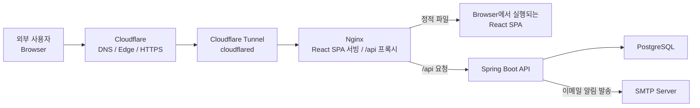
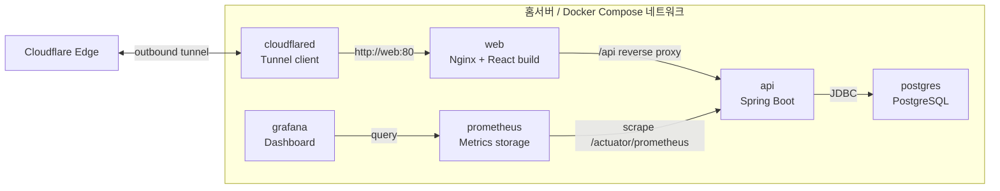
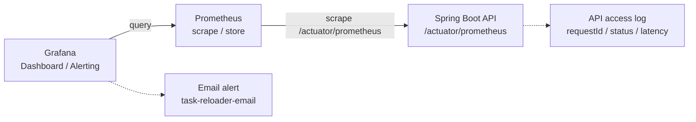

# Task Reloader Architecture

이 문서는 Task Reloader의 운영 기준 아키텍처와 요청 흐름을 설명한다.
실행 방법, 환경 변수, Cloudflare Tunnel 설정 절차는 [infra/README.md](../infra/README.md)를 기준으로 한다.

## 전체 구조

Task Reloader는 외부 사용자가 Cloudflare를 통해 접근하고, 홈서버는 Cloudflare Tunnel을 통해 요청을 수신하는 구조다.
홈서버의 서비스 포트를 직접 인터넷에 노출하지 않고도 공개 도메인으로 서비스를 제공할 수 있도록 구성했다.

## Cloudflare Tunnel 선택 이유

홈서버에서 서비스를 공개하는 가장 단순한 방법은 공유기에서 80/443 포트를 열고 홈서버로 포트포워딩하는 것이다.
하지만 이 방식은 홈 네트워크의 인바운드 진입점을 인터넷에 직접 노출해야 하므로 보안상 부담이 크다.

Task Reloader는 포트포워딩 대신 Cloudflare Tunnel을 사용한다.
홈서버의 `cloudflared`가 Cloudflare로 outbound tunnel을 만들고, 외부 요청은 이 터널을 통해 내부 `web` 컨테이너로 전달된다.
이 구조에서는 공유기에서 서비스 포트를 직접 열 필요가 없다.

Cloudflare Tunnel을 선택한 이유는 다음과 같다.

- 홈서버의 80/443 포트를 인터넷에 직접 노출하지 않는다.
- 공유기 포트포워딩 설정 없이 공개 도메인으로 서비스할 수 있다.
- 외부 요청 진입점을 Cloudflare로 한정해 홈 네트워크의 공격 표면을 줄인다.
- HTTPS와 DNS 관리를 Cloudflare 기준으로 일관되게 가져갈 수 있다.
- 홈서버 내부 서비스는 Docker 네트워크 안에서 `web`, `api` 같은 서비스 이름으로만 통신한다.

대신 Cloudflare 계정, Tunnel token, Cloudflare 장애 여부에 운영 의존성이 생긴다.
이 트레이드오프를 감수하더라도, 개인 홈서버 환경에서는 공유기 포트 개방을 피하는 보안상 이점이 더 크다고 판단했다.

## 런타임 구성

운영 실행은 Docker Compose 기준으로 구성한다.
`cloudflared`, `web`, `api`, `postgres`, `prometheus`, `grafana`가 같은 Compose 네트워크에서 동작하며, 외부 공개 트래픽은 Cloudflare Tunnel을 통해 `web` 컨테이너로 들어온다.

`홈서버` 박스 안의 컨테이너들은 같은 Docker Compose 네트워크에서 실행되며, 컨테이너 간 통신은 서비스 이름으로 이루어진다.

## 요청 흐름

1. 외부 사용자는 공개 도메인으로 Task Reloader에 접근한다.
2. Cloudflare는 HTTPS/DNS edge 역할을 수행하고 요청을 Cloudflare Tunnel로 전달한다.
3. 홈서버의 `cloudflared` 컨테이너는 Cloudflare와의 outbound tunnel을 통해 요청을 받는다.
4. `cloudflared`는 같은 Docker 네트워크의 `web` 컨테이너(`http://web:80`)로 요청을 전달한다.
5. Nginx는 React SPA 정적 파일을 서빙하고, SPA 라우팅을 위해 존재하지 않는 경로는 `index.html`로 fallback한다.
6. `/api` 경로의 요청은 Nginx가 Spring Boot API 컨테이너(`api:8080`)로 프록시한다.
7. Spring Boot API는 PostgreSQL에 데이터를 저장하고 조회한다.

## Nginx 역할

Nginx는 사용자에게 보이는 단일 웹 진입점이다.

- React build 산출물을 정적 파일로 서빙한다.
- SPA 라우팅을 위해 존재하지 않는 경로를 `index.html`로 fallback한다.
- `/api` 요청을 내부 Docker 네트워크의 Spring Boot API 컨테이너로 프록시한다.
- 정적 자산에는 장기 캐시 헤더를 적용한다.
- 프록시 요청에는 `Host`, `X-Real-IP`, `X-Forwarded-For`, `X-Forwarded-Proto`를 전달한다.

## API와 데이터 저장소

Spring Boot API는 Task Reloader의 도메인 로직과 인증 흐름을 담당한다.

- Java 17 / Spring Boot 기반 API 서버
- Spring Data JPA를 통한 PostgreSQL 접근
- Flyway 기반 DB schema migration
- SMTP 연동을 통한 작업 마감 이메일 알림 발송
- `/healthz` health check
- Spring Actuator와 Micrometer 기반 Prometheus metrics 노출

PostgreSQL은 작업, 완료 이력, 사용자, 알림 설정과 발송 이력 데이터를 저장한다.
컨테이너의 데이터는 Docker volume에 저장해 컨테이너 재생성 후에도 유지한다.

## 관측성

API는 Actuator의 Prometheus endpoint를 통해 metrics를 노출하고, Prometheus가 이를 주기적으로 수집한다.
Grafana는 Prometheus를 datasource로 사용해 운영 대시보드를 제공하고, Grafana Alerting으로 핵심 운영 알림을 평가한다.

Grafana 대시보드에서는 다음 지표를 중심으로 상태를 확인한다.

- 요청량(RPS)
- 상태 코드별 요청량
- 5xx 에러율
- p95 latency
- 느린 API Top5
- 5xx endpoint Top5

장애나 성능 저하가 보이면 Grafana에서 문제가 집중된 endpoint를 확인하고, API access log의 `requestId`를 기준으로 세부 로그를 추적한다.
기본 Alert Rule은 `API Down`, `5xx Error Rate High`, `p95 Latency High` 세 가지이며, 홈서버 운영에서 알림 피로를 줄이기 위해 지속 시간과 최소 요청률 조건을 둔다.

## 포트 노출 원칙

운영 구성의 기본 원칙은 홈서버 포트를 직접 인터넷에 노출하지 않는 것이다.

- 공개 트래픽은 Cloudflare Tunnel을 통해서만 들어온다.
- `web`, `api`, `postgres`, `prometheus`, `grafana`의 host published port는 `127.0.0.1`에만 바인딩한다.
- `cloudflared`는 host port를 열지 않고 Cloudflare로 outbound tunnel을 만든다.
- 컨테이너 간 통신은 Docker 내부 네트워크의 서비스 이름(`web`, `api`, `postgres`, `prometheus`)을 사용한다.
- 관리/관측 도구 접근은 공개 서비스 경로와 분리해 운영한다.

## 관련 파일

- [infra/docker-compose.yml](../infra/docker-compose.yml): 런타임 컨테이너 구성
- [apps/web/nginx.conf](../apps/web/nginx.conf): React SPA 서빙과 `/api` 프록시
- [infra/monitoring/prometheus/prometheus.yml](../infra/monitoring/prometheus/prometheus.yml): Prometheus scrape 설정
- [infra/monitoring/grafana/dashboards/task-reloader-overview.json](../infra/monitoring/grafana/dashboards/task-reloader-overview.json): Grafana 대시보드
- [infra/monitoring/grafana/provisioning/alerting/task-reloader-alerting.yml](../infra/monitoring/grafana/provisioning/alerting/task-reloader-alerting.yml): Grafana contact point와 notification policy
- [infra/monitoring/grafana/provisioning/alerting/task-reloader-rules.yml](../infra/monitoring/grafana/provisioning/alerting/task-reloader-rules.yml): Grafana alert rule
- [infra/README.md](../infra/README.md): 실행, 환경 변수, Cloudflare Tunnel 운영 절차
