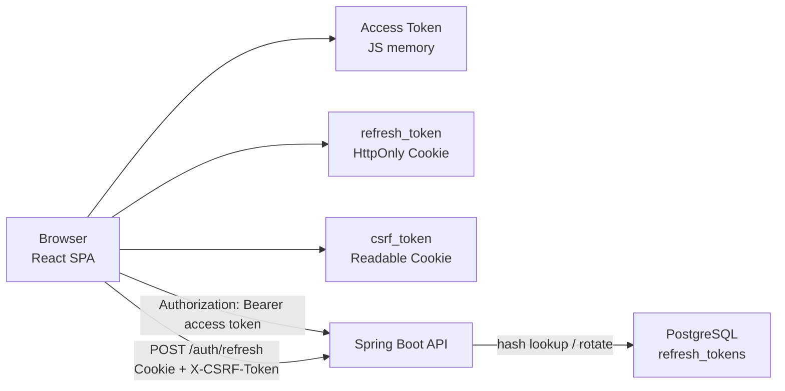
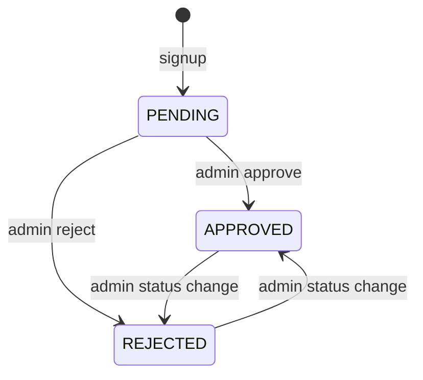
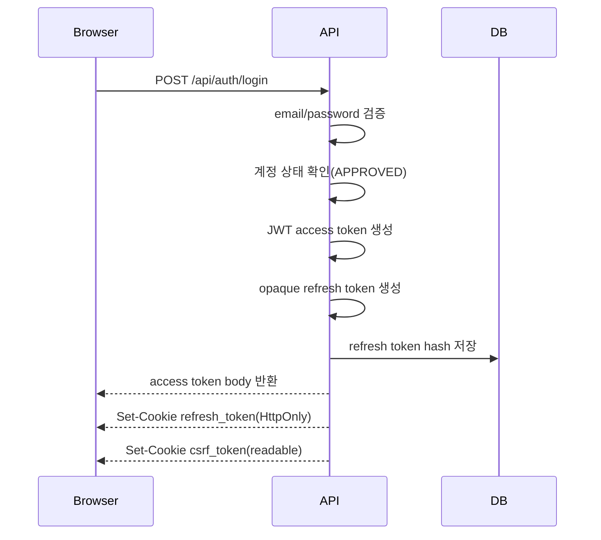
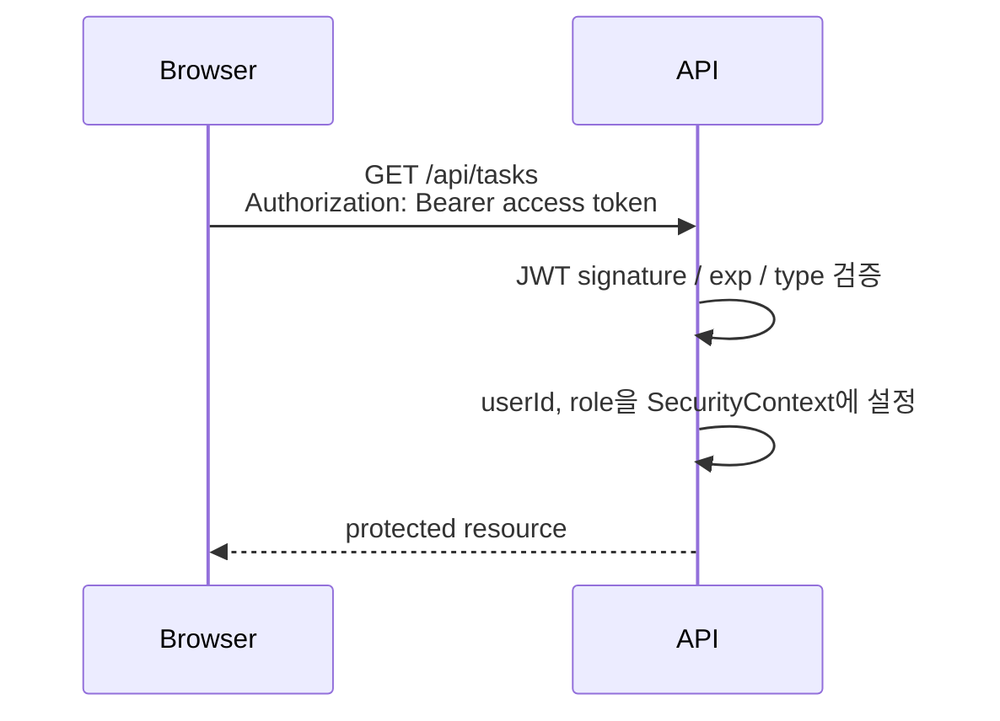
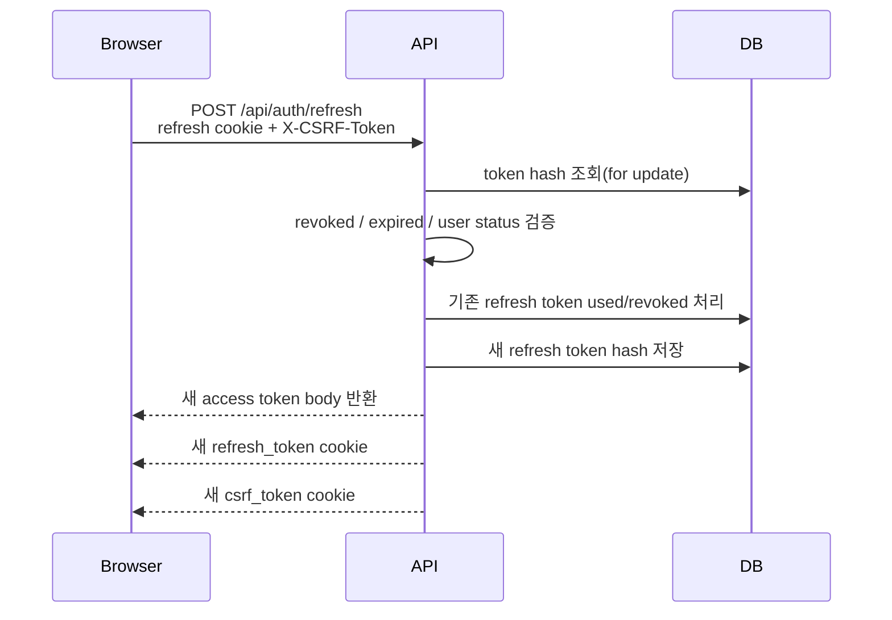
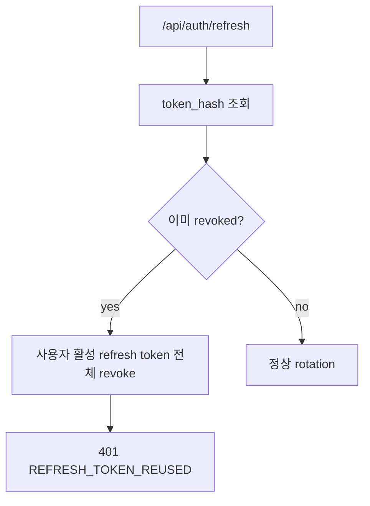
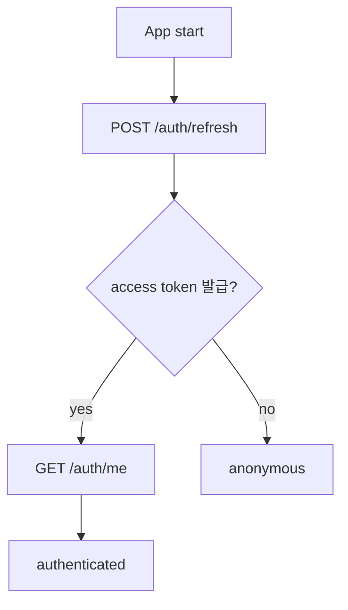
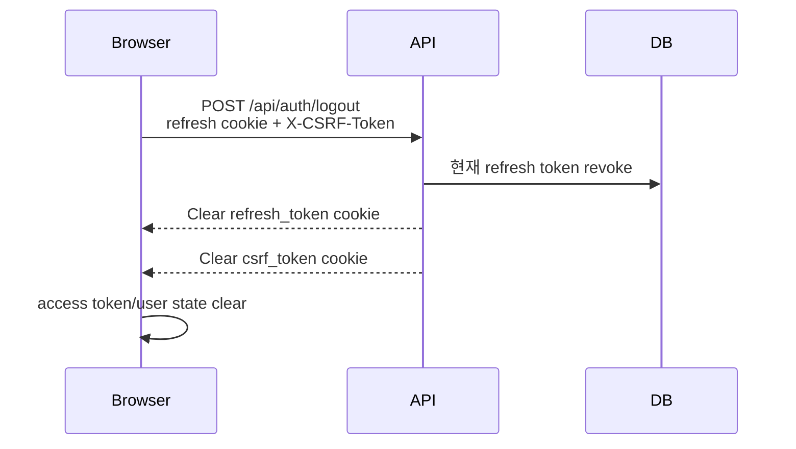

# Auth & Refresh Token Architecture

이 문서는 Task Reloader의 인증 구조, access token/refresh token 역할, refresh token rotation, CSRF 보호 흐름을 정리한다.
API endpoint 목록은 [api.md](api.md)를 기준으로 하고, 이 문서는 보안 흐름과 구현 의도에 집중한다.

## 1. 전체 구조

Task Reloader는 짧은 수명의 JWT access token과 긴 수명의 opaque refresh token을 함께 사용한다.
API 요청 인증은 bearer access token으로 처리하고, access token 재발급은 HttpOnly refresh cookie를 통해 수행한다.

핵심 역할은 다음과 같다.

| 요소 | 위치 | 역할 |
| --- | --- | --- |
| Access token | 브라우저 메모리 | 일반 API 호출의 bearer 인증 |
| Refresh token | HttpOnly cookie | access token 재발급 |
| Refresh token hash | PostgreSQL | refresh token 검증, 회전, 폐기 상태 저장 |
| CSRF token | readable cookie + header | refresh/logout처럼 cookie가 자동 전송되는 요청 보호 |

## 2. 선택 이유

access token만 사용하는 구조는 단순하지만, 토큰을 오래 유지하면 탈취 시 피해 시간이 길어진다.
반대로 access token을 짧게 유지하면 사용자는 자주 로그아웃되는 경험을 겪는다.

Task Reloader는 access token을 짧게 두고, refresh token으로 세션을 연장한다.
refresh token은 JavaScript에서 읽을 수 없는 HttpOnly cookie에 저장하고, 서버에는 원문이 아니라 SHA-256 hash만 저장한다.
이를 통해 일반 API 호출은 stateless JWT로 단순하게 처리하면서도, 세션 연장과 폐기 여부는 서버에서 제어할 수 있게 했다.

## 3. 회원가입과 승인 상태

신규 회원가입 사용자는 바로 API를 사용할 수 없고 `PENDING` 상태로 생성된다.
관리자가 승인하면 `APPROVED` 상태가 되고, 로그인과 refresh가 허용된다.
거절된 사용자는 `REJECTED` 상태가 되며 로그인/refresh가 차단된다.

상태가 `REJECTED`로 바뀌면 해당 사용자의 활성 refresh token을 폐기한다.
refresh 시점에도 사용자가 더 이상 `APPROVED`가 아니면 활성 token을 모두 폐기하고 재인증을 요구한다.

## 4. 로그인 흐름

로그인은 access token을 응답 body로 내려주고, refresh token과 CSRF token을 cookie로 설정한다.

로그인 단계에서 함께 적용되는 보호 장치:

- 이메일은 정규화해서 조회한다.
- 로그인 IP/IP+email 기준 rate-limit을 적용한다.
- 비밀번호 실패 횟수가 누적되면 계정을 일정 시간 잠근다.
- `PENDING`, `REJECTED` 계정은 token을 발급하지 않는다.

## 5. 일반 API 인증 흐름

React SPA는 로그인/refresh로 받은 access token을 브라우저 메모리에만 저장한다.
일반 API 호출에는 `Authorization: Bearer <access token>` header를 붙인다.

access token에는 다음 정보가 포함된다.

- `sub`: user id
- `role`: `USER` 또는 `ADMIN`
- `type`: `ACCESS`
- `jti`, `iat`, `exp`

`/api/admin/**` 경로는 access token의 role을 기준으로 `ADMIN` 권한을 요구한다.

## 6. Refresh Token Rotation

access token이 만료되면 브라우저는 `/api/auth/refresh`를 호출해 새 access token을 받는다.
이때 refresh token은 cookie로 자동 전송되고, 서버는 DB에 저장된 hash로 token을 찾는다.

구현상 중요한 지점:

- refresh token 원문은 서버 DB에 저장하지 않고 SHA-256 hash만 저장한다.
- refresh token 조회는 pessimistic write lock으로 처리해 동시에 같은 token을 회전시키는 상황을 줄인다.
- 정상 refresh가 성공하면 기존 refresh token은 `last_used_at`을 기록하고 `revoked_at`을 설정한다.
- 새 access token과 새 refresh token을 함께 발급한다.
- refresh cookie와 CSRF cookie도 새 값으로 다시 설정한다.

## 7. 재사용 감지

이미 `revoked_at`이 설정된 refresh token이 다시 들어오면 refresh token 재사용으로 판단한다.
이 경우 해당 사용자에게 남아 있는 활성 refresh token을 모두 폐기하고 `REFRESH_TOKEN_REUSED` 응답을 반환한다.

이 정책은 탈취되었거나 오래된 refresh token이 다시 사용되는 상황에서 세션을 보수적으로 종료하기 위한 것이다.

## 8. CSRF 보호

`/api/auth/refresh`와 `/api/auth/logout`은 refresh cookie가 자동으로 전송되는 endpoint다.
그래서 이 두 endpoint는 별도의 CSRF 검증을 수행한다.

브라우저는 로그인/refresh 시 받은 readable `csrf_token` cookie 값을 읽어 `X-CSRF-Token` header에 실어 보낸다.
서버는 refresh cookie가 있는 요청에 대해 다음을 확인한다.

- HTTP method가 `POST`인지
- path가 `/api/auth/refresh` 또는 `/api/auth/logout`인지
- `Origin`이 현재 origin 또는 허용 origin인지
- `csrf_token` cookie와 `X-CSRF-Token` header가 안전 비교로 일치하는지

refresh cookie는 HttpOnly라 JavaScript가 읽을 수 없지만, 브라우저가 자동 전송한다.
따라서 refresh/logout 요청은 cookie만으로 처리하지 않고, readable CSRF cookie와 header를 함께 요구한다.

## 9. Frontend Session Flow

프론트는 access token을 localStorage/sessionStorage에 저장하지 않는다.
페이지를 새로고침하면 메모리의 access token은 사라지고, 앱 초기화 시 `/api/auth/refresh`를 호출해 세션을 복구한다.

일반 API 요청이 401을 받으면 API client는 refresh를 한 번 시도한다.
refresh가 성공하면 새 access token으로 원래 요청을 재시도한다.
여러 요청이 동시에 401을 받는 경우에는 in-flight refresh promise를 공유해 refresh 요청이 과도하게 중복되지 않도록 한다.
refresh가 실패하면 access token과 사용자 상태를 지우고 세션 만료 안내를 표시한다.

## 10. Logout

로그아웃은 현재 refresh cookie에 들어 있는 token을 찾아 revoke하고, refresh/CSRF cookie를 삭제한다.
프론트는 메모리의 access token과 사용자 상태를 지우고, 다른 탭에도 logout 이벤트를 전파한다.

## 11. 운영 설정

주요 설정은 `infra/.env`와 `application-local.yml`을 통해 주입한다.

| 설정 | 역할 |
| --- | --- |
| `AUTH_JWT_SECRET` | access token 서명 secret |
| `AUTH_ACCESS_TOKEN_TTL_SECONDS` | access token TTL. 기본 예시는 `900`초 |
| `AUTH_REFRESH_TOKEN_TTL_SECONDS` | refresh token TTL. 기본 예시는 `1209600`초 |
| `AUTH_REFRESH_COOKIE_NAME` | refresh cookie 이름. 기본값 `refresh_token` |
| `AUTH_REFRESH_COOKIE_PATH` | refresh cookie path. 기본값 `/api/auth` |
| `AUTH_REFRESH_COOKIE_SECURE` | 운영 HTTPS 환경에서는 `true` 유지 |
| `AUTH_REFRESH_COOKIE_SAME_SITE` | 기본값 `Lax` |
| `AUTH_CSRF_COOKIE_NAME` | CSRF cookie 이름. 기본값 `csrf_token` |
| `AUTH_CSRF_HEADER_NAME` | CSRF header 이름. 기본값 `X-CSRF-Token` |
| `AUTH_CSRF_ALLOWED_ORIGINS` | refresh/logout 허용 origin |
| `AUTH_RATE_LIMIT_ENABLED` | auth endpoint rate-limit 활성화 |

운영에서는 단일 오리진(`/api` reverse proxy) 구성을 유지하고, refresh/CSRF cookie의 `Secure=true` 설정을 사용한다.
로컬 HTTP 테스트에서는 cookie secure 설정과 allowed origin을 로컬 주소에 맞춰 오버라이드한다.

## 12. 관련 파일

- [AuthController.java](../apps/api/src/main/java/com/yegkim/task_reloader_api/auth/controller/AuthController.java)
- [AuthService.java](../apps/api/src/main/java/com/yegkim/task_reloader_api/auth/service/AuthService.java)
- [JwtTokenProvider.java](../apps/api/src/main/java/com/yegkim/task_reloader_api/auth/jwt/JwtTokenProvider.java)
- [JwtAuthenticationFilter.java](../apps/api/src/main/java/com/yegkim/task_reloader_api/auth/security/JwtAuthenticationFilter.java)
- [AuthCsrfProtectionFilter.java](../apps/api/src/main/java/com/yegkim/task_reloader_api/auth/security/AuthCsrfProtectionFilter.java)
- [RefreshTokenRepository.java](../apps/api/src/main/java/com/yegkim/task_reloader_api/auth/repository/RefreshTokenRepository.java)
- [api client](../apps/web/src/api/client.ts)
- [AuthContext.tsx](../apps/web/src/auth/AuthContext.tsx)
- [infra/README.md](../infra/README.md)
