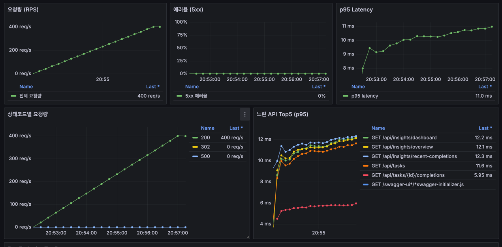

# k6 Extended Read Suite 결과 요약

- 실행 시각(KST): 2026-03-30 21:03:57
- 실행 커맨드: `BASE_URL=http://localhost:8080 VUS=50 DURATION=5m k6 run infra/load/k6-read-suite-extended.js --summary-export infra/load/results/k6-read-suite-extended-20260330-210357.json`
- 스크립트: `infra/load/k6-read-suite-extended.js`
- 원본 결과(JSON): `infra/load/results/k6-read-suite-extended-20260330-210357.json`

## 실행 설정

- VUs: 50
- Duration: 5m
- 테스트 유형: GET API read suite (batch)

## 전체 결과

- Iterations: 14,756 (47.05 iter/s)
- HTTP requests: 103,292 (329.36 req/s)
- 실패율(`http_req_failed`): 0.00%
- 체크 성공률(`checks`): 206,584 / 206,584 (100.00%)
- 전체 지연시간(`http_req_duration`): avg 7.71ms / p95 18.60ms
- 수신/송신 데이터: 146,748,120 bytes / 10,048,836 bytes

## 엔드포인트별 p95

| Endpoint tag | API | p95(ms) | SLO | 판정 |
|---|---|---:|---:|---|
| `tasks_due_now` | `GET /api/tasks?status=DUE_NOW` | 20.15 | < 800 | PASS |
| `tasks_upcoming` | `GET /api/tasks?status=UPCOMING` | 19.64 | < 800 | PASS |
| `insights_dashboard` | `GET /api/insights/dashboard` | 20.22 | < 1000 | PASS |
| `insights_overview` | `GET /api/insights/overview?days=30&top=5` | 20.10 | < 1000 | PASS |
| `insights_recent` | `GET /api/insights/recent-completions` | 20.44 | < 1000 | PASS |
| `task_detail` | `GET /api/tasks/{id}` | 11.62 | < 1000 | PASS |
| `task_completions_monthly` | `GET /api/tasks/{id}/completions?year=YYYY&month=MM` | 11.85 | < 1000 | PASS |

## 결론

- 5분/동시 50명 조건에서 모든 threshold를 만족했습니다.
- 현재 기준으로 read API는 안정적으로 동작하며, 병목 징후(지연 급등/에러율 증가)는 관찰되지 않았습니다.

