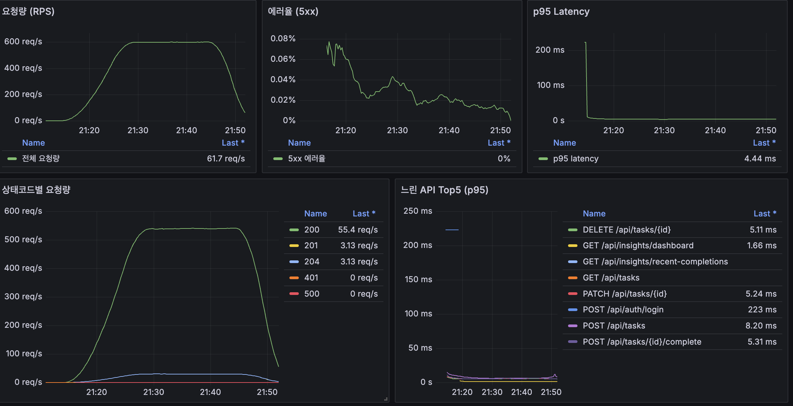
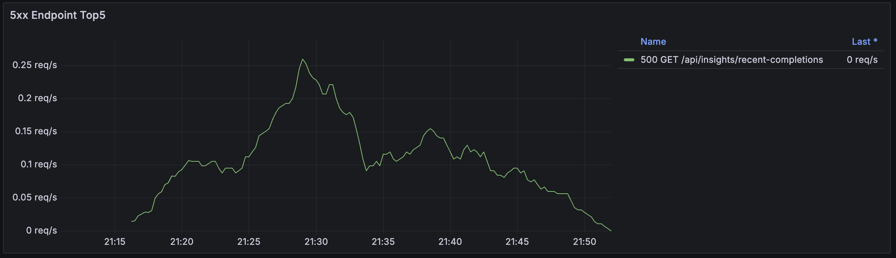

# Local Mixed Fixed Token 부하테스트 결과 정리

본 문서는 `infra/load/results/local-mixed-fixed-token-20260530-121407` 실행 결과를 기준으로 작성한 성능 분석 보고서입니다.

이번 테스트는 `mixed-peak` 시나리오를 고정 access token 방식으로 실행해, 인증 재시도와 rate-limit 영향을 분리한 상태에서 read/write API가 어느 정도 안정적으로 처리되는지 확인하기 위해 수행했습니다.

## 1) 결론 요약

- `50 VU` 유지 구간에서 Grafana 기준 약 `600 req/s` 수준의 처리량이 관찰되었습니다.
- k6 전체 평균 RPS는 `462.09 req/s`, 총 요청 수는 `970,465`건입니다.
- 전체 p95 latency는 `5.49 ms`, p99 latency는 `6.28 ms`로 낮게 유지되었습니다.
- HTTP 실패율은 `0.0243%`, checks 성공률은 `99.9757%`입니다.
- 고정 토큰 방식에서는 `401`, `429`가 사실상 제거되어, 이전 mixed 테스트의 대량 실패가 API 본체 처리량 부족보다는 인증 재시도 및 rate-limit 경합에서 발생했음을 확인했습니다.
- 남은 실패는 `GET /api/insights/recent-completions`의 간헐적 `500`으로 좁혀졌습니다.

정리하면, 고정된 인증 조건에서 mixed read/write 부하는 안정적으로 처리되었습니다. 다만 `recent-completions`의 `500`은 수치가 작더라도 서버 내부 예외이므로 별도 수정 대상입니다.

## 2) 이 테스트를 수행한 목적

이전 mixed/soak 테스트에서는 `401`, `429`, `500`이 함께 관찰되었습니다. 이 상태에서는 문제가 어디에 있는지 분리하기 어렵습니다.

- read/write API가 실제로 부하를 못 버틴 것인지
- access token 만료 또는 재로그인 흐름이 과도하게 발생한 것인지
- 같은 계정으로 여러 VU가 동시에 로그인하면서 인증 rate-limit에 걸린 것인지
- 특정 API endpoint만 내부 예외를 내고 있는 것인지

이번 테스트의 목적은 위 문제를 한 번에 모두 해결하는 것이 아니라, 원인을 분리할 수 있도록 조건을 통제하는 것이었습니다.

핵심 통제 조건은 다음과 같습니다.

- 테스트 시작 전에 발급한 access token을 `ACCESS_TOKEN`으로 고정합니다.
- k6 실행 중에는 `/api/auth/login`을 반복 호출하지 않습니다.
- `RELOGIN_ON_401=false`로 설정해 401 발생 시 자동 재로그인을 하지 않습니다.
- read/write 업무 API만 혼합 부하로 실행합니다.

이렇게 하면 인증 시스템 자체의 성능이나 rate-limit 정책을 테스트하는 것이 아니라, 이미 인증된 사용자가 서비스를 사용할 때 주요 API가 어느 정도 안정적으로 처리되는지 확인할 수 있습니다.

## 3) 실행 환경과 조건

### 3.1 실행 시각

`mixed-peak/case-env.txt` 기준입니다.

| 항목 | 값 |
|---|---|
| 시작 시각 (UTC) | `2026-05-30T12:14:11+00:00` |
| 종료 시각 (UTC) | `2026-05-30T12:49:20+00:00` |
| 시작 시각 (KST) | `2026-05-30 21:14:11` |
| 종료 시각 (KST) | `2026-05-30 21:49:20` |
| 총 실행 시간 | `2109초` (`35분 9초`) |

### 3.2 서버 스펙

| 항목 | 값 |
|---|---|
| CPU | AMD Ryzen 5 PRO 6650H |
| Memory | 16GB |
| Storage | 512GB SSD |
| 대상 URL | `http://127.0.0.1:3000` |

### 3.3 k6 실행 설정

| 항목 | 값 |
|---|---|
| k6 script | `infra/load/k6-auth-mixed-peak-local.js` |
| 실행 모드 | `SUITE_MODE=mixed` |
| 인증 방식 | 고정 `ACCESS_TOKEN` |
| 재로그인 | `RELOGIN_ON_401=false` |
| read/write 혼합비 | read `70%`, write `30%` |
| iteration sleep | `0.5s` |
| 최대 VU | `50` |

## 4) 테스트 방식

### 4.1 부하 패턴

이번 테스트는 갑자기 최대 부하를 주는 방식이 아니라, 사용자가 점진적으로 늘어난 뒤 일정 시간 유지되고 다시 빠지는 형태로 구성했습니다.

| 구간 | 시간 | VU 변화 | 목적 |
|---|---:|---:|---|
| Ramp-up 1 | 5분 | `0 -> 20 VU` | 낮은 부하에서 API와 DB가 정상적으로 반응하는지 확인 |
| Ramp-up 2 | 5분 | `20 -> 50 VU` | 피크 부하까지 증가시키며 에러율과 latency 변화를 관찰 |
| Peak hold | 20분 | `50 VU 유지` | 피크 상태에서 처리량과 안정성이 유지되는지 확인 |
| Ramp-down | 5분 | `50 -> 0 VU` | 부하 감소 시 에러와 latency가 정상적으로 줄어드는지 확인 |

`VU`는 k6의 virtual user입니다. 실제 사용자 수와 1:1로 완전히 같지는 않지만, 동시에 반복적으로 API를 호출하는 가상의 사용자 수로 보면 됩니다.

### 4.2 Read flow

전체 iteration 중 약 `70%`는 read flow를 수행합니다.

read flow는 핵심 조회 API를 `http.batch`로 묶어 동시에 호출합니다.

| Endpoint | 역할 |
|---|---|
| `GET /api/tasks?status=DUE_NOW` | 오늘 또는 현재 수행 대상 task 목록 조회 |
| `GET /api/tasks?status=UPCOMING` | 예정 task 목록 조회 |
| `GET /api/insights/dashboard` | 대시보드 요약 정보 조회 |
| `GET /api/insights/overview?days=30&top=5` | 최근 기간의 통계 개요 조회 |
| `GET /api/insights/recent-completions` | 최근 완료 기록 조회 |
| `GET /api/tasks/{id}` | 목록에서 선택한 task 상세 조회 |
| `GET /api/tasks/{id}/completions` | 선택한 task의 월별 완료 기록 조회 |

이 방식은 사용자가 화면을 열었을 때 여러 조회 API가 거의 동시에 호출되는 상황을 재현하기 위한 것입니다.

### 4.3 Write flow

전체 iteration 중 약 `30%`는 write flow를 수행합니다.

write flow는 task 하나를 생성한 뒤, 수정하고, 완료 처리하고, 삭제하는 순서로 실행됩니다.

| 순서 | Endpoint | 기대 응답 |
|---:|---|---|
| 1 | `POST /api/tasks` | `201` |
| 2 | `PATCH /api/tasks/{id}` | `200` |
| 3 | `POST /api/tasks/{id}/complete` | `200` |
| 4 | `DELETE /api/tasks/{id}` | `204` 또는 `200` |

이 흐름은 단순 조회 부하가 아니라, 데이터 생성/수정/완료/삭제가 동시에 섞이는 운영 상황을 보기 위한 것입니다.

## 5) Grafana 캡처

### 5.1 전체 대시보드



이 화면에서는 요청량, 5xx 에러율, p95 latency, 상태코드별 요청량, 느린 API Top5를 함께 확인합니다.

핵심 관찰 포인트는 다음과 같습니다.

- 요청량은 ramp-up 구간에서 자연스럽게 증가하고, peak hold 구간에서 약 `600 req/s` 수준으로 유지됩니다.
- 상태코드 패널에서 `401`, `429`가 보이지 않으며, 대부분 `200/201/204`로 처리됩니다.
- p95 latency는 시작 초기에 튀는 구간이 있으나, 본 부하 구간에서는 낮은 수준으로 안정화됩니다.
- 5xx 에러율은 존재하지만 매우 낮은 수준이며, 마지막 시점에는 `0%`로 내려갑니다.

### 5.2 5xx Endpoint Top5



이 화면에서는 5xx가 어느 endpoint에서 발생했는지 확인합니다.

이번 테스트에서 5xx는 `GET /api/insights/recent-completions`에 집중되었습니다. 이는 전체 API가 광범위하게 실패한 것이 아니라, 특정 조회 로직에서 간헐적인 내부 예외가 발생했을 가능성이 높다는 뜻입니다.

## 6) 핵심 수치 요약

### 6.1 전체 지표

| 지표 | 값 | 의미 |
|---|---:|---|
| 총 요청 수 | `970,465` | 테스트 전체에서 서버가 받은 HTTP 요청 수 |
| 평균 RPS | `462.09 req/s` | 전체 테스트 시간 기준 초당 평균 요청 수 |
| Grafana peak RPS | `~600 req/s` | 50 VU 유지 구간에서 관찰된 순간 처리량 |
| 총 iterations | `159,325` | k6 default function이 실행된 횟수 |
| 전체 avg latency | `1.98 ms` | 전체 요청 평균 응답 시간 |
| 전체 p95 latency | `5.49 ms` | 요청의 95%가 이 시간 이하로 응답 |
| 전체 p99 latency | `6.28 ms` | 요청의 99%가 이 시간 이하로 응답 |
| 전체 max latency | `773.85 ms` | 가장 오래 걸린 단일 요청 |
| HTTP 실패율 | `0.0243%` | HTTP 요청 중 실패로 집계된 비율 |
| checks 성공률 | `99.9757%` | k6 check 조건을 통과한 비율 |

`p95`는 평균보다 운영 관점에서 더 중요한 경우가 많습니다. 평균은 일부 느린 요청을 숨길 수 있지만, p95는 대부분의 사용자가 경험하는 상위 지연 시간을 보여주기 때문입니다.

### 6.2 Read/Write flow별 latency

| Flow | Count | avg | p95 | p99 | max |
|---|---:|---:|---:|---:|---:|
| read | 777,385 | 1.34 ms | 2.15 ms | 2.67 ms | 37.58 ms |
| write | 193,080 | 4.56 ms | 6.20 ms | 7.63 ms | 773.85 ms |

read flow는 매우 낮은 latency로 안정적입니다. write flow는 read보다 느리지만, p95 기준 `6.20 ms`로 여전히 낮은 수준입니다.

다만 write flow의 max latency가 `773.85 ms`로 높게 튄 요청이 있습니다. p95/p99에는 크게 영향을 주지 않았으므로 일시적 outlier에 가깝지만, DB checkpoint, 컨테이너 CPU 스케줄링, 단일 요청의 락 대기 같은 요인은 추후 확인할 수 있습니다.

### 6.3 Endpoint별 p95

| Endpoint tag | Count | avg | p95 | p99 | max |
|---|---:|---:|---:|---:|---:|
| `tasks_due_now` | 111,055 | 1.50 ms | 2.26 ms | 2.76 ms | 28.46 ms |
| `tasks_upcoming` | 111,055 | 1.49 ms | 2.23 ms | 2.73 ms | 28.48 ms |
| `insights_dashboard` | 111,055 | 1.66 ms | 2.34 ms | 2.84 ms | 32.20 ms |
| `insights_overview` | 111,055 | 1.58 ms | 2.26 ms | 2.77 ms | 37.58 ms |
| `insights_recent` | 111,055 | 1.41 ms | 2.14 ms | 2.72 ms | 27.69 ms |
| `task_create` | 48,270 | 4.93 ms | 7.12 ms | 9.36 ms | 773.85 ms |
| `task_update` | 48,270 | 4.44 ms | 6.01 ms | 6.76 ms | 43.04 ms |
| `task_complete` | 48,270 | 4.59 ms | 6.04 ms | 6.86 ms | 21.79 ms |

쓰기 계열 endpoint가 조회 계열보다 상대적으로 느립니다. 이는 정상적인 방향입니다. write API는 DB insert/update/delete와 트랜잭션 처리가 포함되기 때문입니다.

## 7) 지표별 해석

### 7.1 RPS

RPS는 `Requests Per Second`의 약자로 초당 처리한 HTTP 요청 수입니다.

이번 테스트에서 평균 RPS는 `462.09 req/s`입니다. Grafana에서는 peak hold 구간에서 약 `600 req/s` 수준이 관찰됩니다. 평균 RPS가 peak보다 낮은 이유는 테스트 전체에 ramp-up/ramp-down 구간이 포함되기 때문입니다.

### 7.2 HTTP 실패율

HTTP 실패율은 k6의 `http_req_failed` 기준입니다.

이번 테스트의 실패율은 `0.0243%`입니다. 전체 요청 `970,465`건 중 약 `236`건이 실패한 수준입니다.

비율만 보면 매우 낮지만, 실패가 `500`이면 의미가 다릅니다. `500`은 서버 내부에서 예외가 발생했다는 뜻이므로, 수치가 작더라도 원인을 추적하고 수정해야 합니다.

### 7.3 checks 성공률

checks는 k6 스크립트에서 직접 정의한 검증 조건입니다.

예를 들어 read API는 단순히 HTTP 200만 확인하지 않고, 응답 body의 `success === true`도 함께 확인합니다. 따라서 checks 성공률은 "서버가 응답했다"보다 조금 더 엄격한 정상 처리 비율입니다.

이번 테스트의 checks 성공률은 `99.9757%`입니다.

### 7.4 상태코드

Grafana 상태코드 패널에서 의미 있게 볼 값은 다음과 같습니다.

| 상태코드 | 의미 | 이번 테스트 해석 |
|---|---|---|
| `200` | 조회/수정/완료 성공 | 대부분의 정상 요청 |
| `201` | 생성 성공 | `POST /api/tasks` 성공 |
| `204` | 삭제 성공 | `DELETE /api/tasks/{id}` 성공 |
| `401` | 인증 실패 | 고정 토큰 조건에서 사실상 제거됨 |
| `429` | rate-limit | 고정 토큰 조건에서 사실상 제거됨 |
| `500` | 서버 내부 예외 | `recent-completions`에서 소량 발생 |

## 8) 실패 패턴 분석

k6 check 기준 실패는 `insights_recent`에만 집중되었습니다.

| Check | Passes | Fails | Fail Ratio |
|---|---:|---:|---:|
| `insights_recent: status 200` | 110,819 | 236 | 0.2125% |
| `insights_recent: success true` | 110,819 | 236 | 0.2125% |
| 기타 endpoint | 전부 성공 | 0 | 0% |

Grafana의 5xx Endpoint Top5에서도 `500 GET /api/insights/recent-completions`만 표시됩니다.

따라서 이번 테스트의 실패는 다음처럼 해석할 수 있습니다.

- 인증 실패가 아닙니다.
- 전체 API가 부하로 무너진 것도 아닙니다.
- write API 전체가 실패한 것도 아닙니다.
- 특정 조회 API인 `recent-completions`에서 간헐적으로 내부 예외가 발생했습니다.

## 9) `recent-completions` 500에 대한 해석

추가 재현 직후 Docker API 로그를 추출해 stack trace를 확보했고, 원인을 확정했습니다.

상세 분석과 수정 기록은 별도 문서에 정리했습니다.

- [`500-root-cause-analysis.md`](./500-root-cause-analysis.md)

확보한 로그 요약은 다음과 같습니다.

```text
total_500_access_lines: 15
recent_completions_500_lines: 15
recent_completions_request_ids: 15

jakarta.persistence.EntityNotFoundException:
No row with the given identifier exists for entity
[com.yegkim.task_reloader_api.task.entity.Task with id '125750']

at com.yegkim.task_reloader_api.task.entity.Task$HibernateProxy.getName(Unknown Source)
at com.yegkim.task_reloader_api.task.service.TaskService.toRecentCompletionResponse(TaskService.java:440)
at com.yegkim.task_reloader_api.task.service.TaskService.findRecentCompletions(TaskService.java:145)
```

즉, 이번 500은 추정이 아니라 `TaskCompletion -> Task` lazy loading 중 연결된 `Task` row가 이미 삭제되어 발생한 `EntityNotFoundException`입니다.

### 9.1 읽기/쓰기 경합 중 연관 데이터 접근 문제

`recent-completions`는 완료 이력을 조회하는 API입니다. 이 API가 완료 이력과 task 정보를 함께 조합한다면, write flow에서 다음 작업이 동시에 일어나는 상황과 겹칠 수 있습니다.

- task 생성
- task 수정
- task 완료 기록 생성
- task 삭제
- 최근 완료 기록 조회

기존 조회 로직은 completion을 먼저 읽고, 이후 DTO 변환 중 `completion.getTask().getName()`으로 연관 task를 lazy loading했습니다. mixed write flow에서는 task 생성/완료/삭제가 빠르게 반복되므로, completion 목록을 읽은 뒤 task proxy를 초기화하는 짧은 사이에 연결된 task가 삭제될 수 있었습니다.

확정된 실패 흐름은 다음과 같습니다.

```text
1. recent-completions가 task_completions 목록 조회
2. 다른 VU가 같은 task를 삭제
3. DB의 ON DELETE CASCADE로 연결 completion도 삭제
4. DTO 변환 중 completion.getTask().getName() 호출
5. Hibernate가 task lazy proxy 초기화 시도
6. tasks row가 이미 없어 EntityNotFoundException 발생
7. GlobalExceptionHandler가 500 반환
```

### 9.2 수정 방식

수정은 projection 조회로 진행했습니다.

핵심 변경:

- `TaskCompletion` 엔티티 목록을 반환받은 뒤 `completion.getTask()`를 호출하지 않습니다.
- repository JPQL에서 `TaskCompletion`과 `Task`를 join합니다.
- 필요한 필드를 `RecentTaskCompletionResponse` DTO로 직접 생성합니다.
- 같은 DTO 변환 경로를 쓰는 `today-completions`도 함께 projection으로 변경했습니다.

이 방식은 lazy loading 시점을 제거하므로, 조회 이후 DTO 변환 중 삭제된 task proxy를 다시 조회하는 문제가 사라집니다.

### 9.3 왜 안정화 우선순위에 포함해야 하는가

이번 500은 전체 실패율 관점에서는 작습니다. 하지만 안정화 우선순위에서 제외할 문제는 아닙니다.

우선순위 판단은 다음처럼 보는 것이 적절합니다.

| 이슈 | 범위 | 영향 | 우선순위 |
|---|---|---|---|
| `401/429` 대량 발생 | 인증/재로그인 경로 | 부하테스트 결과 전체를 왜곡 | 이미 원인 분리됨, 인증 시나리오에서 별도 개선 |
| `recent-completions` 500 | 특정 조회 endpoint | 사용자에게 서버 오류 노출 | projection 조회로 수정 |
| write max latency outlier | 일부 write 요청 | 순간 지연 가능성 | 로그/DB 지표로 추가 관찰 |

즉, 이번 테스트의 중심 결론은 "API 전체가 무너진 것은 아니다"입니다. 동시에 `recent-completions` 500은 실제 서버 예외였고, 로그 기반으로 원인을 확정한 뒤 projection 조회로 수정했습니다.

## 10) 기존 Mixed 테스트와 비교

| 항목 | 기존 Mixed (`RELOGIN_ON_401=true`) | 고정 토큰 Mixed |
|---|---:|---:|
| 평균 RPS | 415.59 req/s | 462.09 req/s |
| 총 요청 수 | 872,832 | 970,465 |
| HTTP 실패율 | 45.42% | 0.0243% |
| checks 성공률 | 51.37% | 99.9757% |
| 전체 p95 | 4.10 ms | 5.49 ms |
| 주요 실패 원인 | `401/429` 인증 병목 | `insights_recent` 간헐 500 |

이 비교에서 가장 중요한 점은 실패율 변화입니다.

동일한 mixed 성격의 부하에서 고정 토큰을 사용하자 실패율이 `45.42%`에서 `0.0243%`로 감소했습니다. 이는 기존 mixed 테스트의 대량 실패가 read/write API의 순수 처리량 한계보다는 인증 재시도 경로와 rate-limit 경합에 의해 크게 증폭되었음을 보여줍니다.

## 11) 이번 결과의 함의

### 11.1 확인한 것

- 인증이 정상적으로 유지되는 조건에서는 mixed read/write API가 `50 VU`, peak 약 `600 req/s` 수준을 안정적으로 처리했습니다.
- read API는 p95 `2 ms`대, write API는 p95 `6 ms`대로 낮게 유지되었습니다.
- 대량의 `401/429`는 API 본체의 성능 문제가 아니라 인증 재시도 전략과 rate-limit 조건에서 발생한 문제로 분리되었습니다.
- `recent-completions`는 독립적인 안정화 대상임이 확인되었습니다.

### 11.2 확인하지 않은 것

이번 테스트는 모든 운영 안정성을 증명하는 테스트는 아닙니다.

- access token 발급 API의 처리량을 검증한 테스트가 아닙니다.
- refresh/relogin 전략이 운영 부하에서 안전한지 검증한 테스트가 아닙니다.
- 여러 실제 계정이 섞인 장시간 사용 패턴을 검증한 테스트가 아닙니다.
- 외부 네트워크, SSL, 운영 DB 스펙, 실제 사용자 브라우저 동작까지 포함한 end-to-end 운영 부하 테스트는 아닙니다.

따라서 이 결과는 "운영 환경 전체가 안전하다"보다는 "인증 병목을 제거하면 현재 read/write API 본체는 목표 부하에서 안정적으로 동작한다"는 결론으로 해석하는 것이 정확합니다.

## 12) 후속 조치

### 12.1 우선 수정 대상

1. `GET /api/insights/recent-completions` 500 원인 확인: 완료
2. stack trace 기반으로 조회 로직 수정: 완료
3. projection 조회 적용: 완료
4. 같은 시나리오를 재실행해 5xx가 0에 수렴하는지 확인: 남은 검증

### 12.2 별도 테스트로 분리할 항목

인증 성능과 API 본체 성능은 목적이 다르므로 분리해서 보는 것이 좋습니다.

| 테스트 | 목적 |
|---|---|
| 고정 토큰 mixed 테스트 | 인증 병목 제거 후 read/write API 처리량 확인 |
| 계정 풀 mixed 테스트 | 여러 사용자 계정이 섞인 운영형 사용 패턴 확인 |
| auth/relogin 테스트 | 로그인, 토큰 만료, 재로그인, rate-limit 정책 검증 |
| recent-completions 집중 테스트 | 특정 500 endpoint 재현 및 수정 검증 |
| 장시간 soak 테스트 | 메모리, DB connection, latency drift 확인 |

### 12.3 재실행 기준

다음 실행에서는 아래 기준을 함께 보는 것이 좋습니다.

- `http_req_failed < 1%`
- `checks > 99%`
- `401/429`이 의도하지 않게 누적되지 않을 것
- `5xx`가 0에 수렴할 것
- `recent-completions` 실패가 재현되면 requestId와 stack trace가 즉시 확인될 것
- write max latency outlier가 반복되는지 확인할 것

## 13) 원본 데이터 위치

| 항목 | 경로 |
|---|---|
| 실행 루트 | `infra/load/results/local-mixed-fixed-token-20260530-121407` |
| k6 summary | `mixed-peak/summary.json` |
| 요약 텍스트 | `k6-summary.txt` |
| 실행 환경 | `test-env.txt` |
| case 환경 | `mixed-peak/case-env.txt` |
| Grafana overview | `grafana-mixed-fixed-token-overview.png` |
| Grafana 5xx endpoint | `grafana-mixed-fixed-token-5xx-endpoint-top5.png` |
| 500 원인 분석 | `500-root-cause-analysis.md` |
