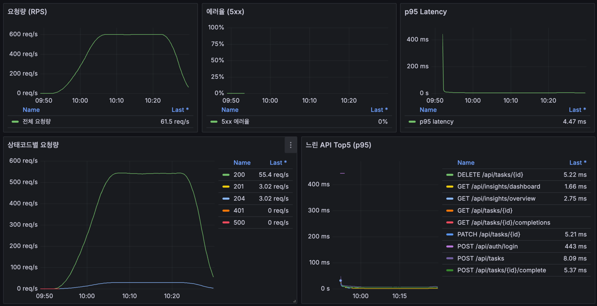
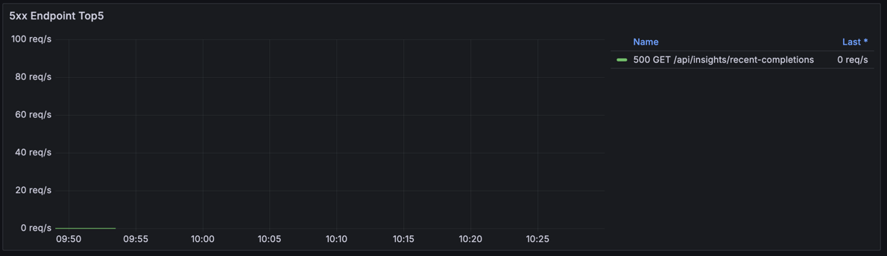

# Local Mixed Fixed Token 재검증 결과 정리

본 문서는 `infra/load/results/local-mixed-fixed-token-20260531-005152` 실행 결과를 기준으로 작성한 성능 재검증 보고서입니다.

이번 테스트는 `GET /api/insights/recent-completions` 500 원인을 projection 조회로 수정한 뒤, 동일한 fixed-token mixed peak 시나리오에서 500이 재발하는지 확인하기 위해 수행했습니다.

## 1) 결론 요약

- 수정 전 `GET /api/insights/recent-completions`에서 발생하던 간헐적 500이 이번 재검증에서는 재발하지 않았습니다.
- k6 기준 HTTP 실패율은 `0.0000%`, checks 성공률은 `100.0000%`입니다.
- `insights_recent` check는 `111,800`건 모두 성공했고 실패는 `0`건입니다.
- Grafana에서도 5xx 에러율은 `0%`, 상태코드 `500`은 `0 req/s`로 관찰되었습니다.
- 처리량은 평균 `463.20 req/s`, peak 구간 Grafana 기준 약 `600 req/s` 수준으로 유지되었습니다.
- 전체 p95 latency는 `4.92 ms`, p99 latency는 `6.16 ms`로 수정 전과 동등하거나 더 안정적입니다.

정리하면, projection 조회 적용 후 fixed-token mixed 부하에서 `recent-completions` 500은 해결된 것으로 판단할 수 있습니다.

## 2) 테스트 목적

이전 fixed-token mixed 테스트에서는 인증 재시도와 rate-limit 영향이 제거된 상태에서도 `GET /api/insights/recent-completions`에서 소량의 500이 발생했습니다.

로그 분석으로 확인한 원인은 다음과 같습니다.

```text
jakarta.persistence.EntityNotFoundException:
No row with the given identifier exists for entity
[com.yegkim.task_reloader_api.task.entity.Task with id '125750']

at TaskService.toRecentCompletionResponse(TaskService.java:440)
at TaskService.findRecentCompletions(TaskService.java:145)
```

즉, `TaskCompletion`을 먼저 조회한 뒤 DTO 변환 중 `completion.getTask().getName()`으로 `Task`를 lazy loading하는 구조가 문제였습니다. mixed write flow에서 task 생성/완료/삭제가 빠르게 반복되면서, 조회 시점과 lazy loading 시점 사이에 연결된 task가 삭제될 수 있었고 이때 `EntityNotFoundException`이 발생했습니다.

수정은 `TaskCompletion` entity를 조회한 뒤 `Task`를 lazy loading하지 않고, repository JPQL에서 `TaskCompletion`과 `Task`를 join해 `RecentTaskCompletionResponse` DTO를 직접 생성하는 projection 방식으로 진행했습니다.

이번 재검증의 목적은 다음을 확인하는 것입니다.

- projection 수정 후 `recent-completions` 500이 사라지는지
- read/write mixed 부하에서 전체 실패율이 0%로 유지되는지
- projection 변경이 latency를 악화시키지 않는지
- Grafana 기준 5xx, 상태코드, p95 latency가 안정적인지

## 3) 실행 조건

### 3.1 실행 시각

`mixed-peak/case-env.txt` 기준입니다.

| 항목 | 값 |
|---|---|
| 시작 시각 (UTC) | `2026-05-31T00:51:56+00:00` |
| 종료 시각 (UTC) | `2026-05-31T01:27:05+00:00` |
| 시작 시각 (KST) | `2026-05-31 09:51:56` |
| 종료 시각 (KST) | `2026-05-31 10:27:05` |
| 총 실행 시간 | `2109초` (`35분 9초`) |

### 3.2 실행 환경

| 항목 | 값 |
|---|---|
| CPU | AMD Ryzen 5 PRO 6650H |
| Memory | 16GB |
| Storage | 512GB SSD |
| 대상 URL | `http://127.0.0.1:3000` |
| k6 script | `infra/load/k6-auth-mixed-peak-local.js` |
| 실행 모드 | `SUITE_MODE=mixed` |
| 인증 방식 | 고정 `ACCESS_TOKEN` |
| 재로그인 | `RELOGIN_ON_401=false` |
| read/write 혼합비 | read `70%`, write `30%` |
| 최대 VU | `50` |

### 3.3 부하 패턴

| 구간 | 시간 | VU 변화 | 목적 |
|---|---:|---:|---|
| Ramp-up 1 | 5분 | `0 -> 20 VU` | 낮은 부하에서 정상 응답 여부 확인 |
| Ramp-up 2 | 5분 | `20 -> 50 VU` | peak 부하까지 증가시키며 오류/지연 추적 |
| Peak hold | 20분 | `50 VU 유지` | 일정 부하에서 처리량과 안정성 확인 |
| Ramp-down | 5분 | `50 -> 0 VU` | 부하 감소 시 지표 회복 확인 |

## 4) Grafana 캡처

### 4.1 전체 대시보드



Grafana overview에서 확인한 내용은 다음과 같습니다.

- 요청량은 ramp-up 이후 peak 구간에서 약 `600 req/s` 수준으로 안정적으로 유지됩니다.
- 5xx 에러율은 `0%`입니다.
- p95 latency는 초반 스파이크 이후 낮은 수준으로 안정화되며, 마지막 값은 `4.47 ms`입니다.
- 상태코드별 요청량에서 `200`, `201`, `204`가 정상적으로 관찰되고 `401`, `500`은 `0 req/s`입니다.
- 느린 API Top5는 write 계열 API가 중심이며, `POST /api/tasks`가 약 `8.09 ms`, `POST /api/tasks/{id}/complete`가 약 `5.37 ms`, `PATCH /api/tasks/{id}`가 약 `5.21 ms` 수준입니다.
- `POST /api/auth/login`은 `443 ms`로 보이지만, 고정 토큰 mixed 테스트의 주 부하 경로가 아니므로 본 API 처리량 판단에서는 보조 지표로 해석합니다.

### 4.2 5xx Endpoint Top5



수정 전에는 `500 GET /api/insights/recent-completions`가 5xx Endpoint Top5에 피크 형태로 나타났습니다.

이번 재검증에서는 같은 endpoint가 표시되더라도 값이 `0 req/s`로 유지됩니다. 즉, 테스트 기간 동안 `recent-completions`의 5xx가 재발하지 않았습니다.

## 5) k6 핵심 수치

| 지표 | 값 |
|---|---:|
| 총 요청 수 | 972,932 |
| 평균 RPS | 463.20 req/s |
| 총 iterations | 159,383 |
| 전체 avg latency | 1.95 ms |
| 전체 p95 latency | 4.92 ms |
| 전체 p99 latency | 6.16 ms |
| 전체 max latency | 65.61 ms |
| HTTP 실패율 | 0.0000% |
| checks 성공률 | 100.0000% |
| 최대 VU | 50 |

### 5.1 Flow별 latency

| Flow | Count | avg | p95 | p99 | max |
|---|---:|---:|---:|---:|---:|
| read | 782,600 | 1.34 ms | 2.17 ms | 2.72 ms | 39.68 ms |
| write | 190,332 | 4.45 ms | 6.12 ms | 7.74 ms | 65.61 ms |

read는 p95 `2.17 ms`, write는 p95 `6.12 ms`로 안정적입니다. write가 read보다 느린 것은 DB insert/update/delete와 트랜잭션 처리 비용이 포함되기 때문에 자연스러운 결과입니다.

### 5.2 Endpoint별 latency

| Endpoint tag | Count | avg | p95 | p99 | max |
|---|---:|---:|---:|---:|---:|
| `tasks_due_now` | 111,800 | 1.50 ms | 2.29 ms | 2.84 ms | 23.24 ms |
| `tasks_upcoming` | 111,800 | 1.50 ms | 2.27 ms | 2.81 ms | 25.28 ms |
| `insights_dashboard` | 111,800 | 1.66 ms | 2.37 ms | 2.93 ms | 28.51 ms |
| `insights_overview` | 111,800 | 1.58 ms | 2.28 ms | 2.86 ms | 35.03 ms |
| `insights_recent` | 111,800 | 1.43 ms | 2.17 ms | 2.72 ms | 24.15 ms |
| `task_create` | 47,583 | 4.83 ms | 7.20 ms | 9.42 ms | 65.61 ms |
| `task_update` | 47,583 | 4.33 ms | 5.96 ms | 6.70 ms | 26.77 ms |
| `task_complete` | 47,583 | 4.47 ms | 6.00 ms | 6.80 ms | 21.51 ms |

`insights_recent`는 projection 수정 후에도 p95 `2.17 ms`, p99 `2.72 ms`로 낮게 유지되었습니다. 즉, 안정성 개선을 위해 projection으로 바꿨지만 latency 회귀는 관찰되지 않았습니다.

## 6) 수정 전/후 비교

| 항목 | 수정 전 | 수정 후 | 해석 |
|---|---:|---:|---|
| 평균 RPS | 462.09 req/s | 463.20 req/s | 처리량 동등 |
| 총 요청 수 | 970,465 | 972,932 | 유사 조건에서 재검증 |
| HTTP 실패율 | 0.0243% | 0.0000% | 실패 제거 |
| checks 성공률 | 99.9757% | 100.0000% | 모든 check 성공 |
| 전체 p95 | 5.49 ms | 4.92 ms | 소폭 개선 |
| 전체 p99 | 6.28 ms | 6.16 ms | 유사 또는 소폭 개선 |
| 전체 max latency | 773.85 ms | 65.61 ms | 큰 outlier 제거 |
| `insights_recent` 실패 | 236건 | 0건 | 핵심 수정 효과 확인 |

Latency 상세 비교:

| Metric | 수정 전 p95 | 수정 후 p95 | 수정 전 p99 | 수정 후 p99 | 수정 전 max | 수정 후 max |
|---|---:|---:|---:|---:|---:|---:|
| overall | 5.49 ms | 4.92 ms | 6.28 ms | 6.16 ms | 773.85 ms | 65.61 ms |
| read | 2.15 ms | 2.17 ms | 2.67 ms | 2.72 ms | 37.58 ms | 39.68 ms |
| write | 6.20 ms | 6.12 ms | 7.63 ms | 7.74 ms | 773.85 ms | 65.61 ms |
| `insights_recent` | 2.14 ms | 2.17 ms | 2.72 ms | 2.72 ms | 27.69 ms | 24.15 ms |

`insights_recent`의 p95/p99는 수정 전후 거의 동일합니다. 따라서 projection 변경은 성능을 희생하지 않고 500 안정성 문제를 해결한 것으로 볼 수 있습니다.

## 7) Check 결과

핵심 check는 모두 성공했습니다.

| Check | Passes | Fails |
|---|---:|---:|
| `insights_recent: status 200` | 111,800 | 0 |
| `insights_recent: success true` | 111,800 | 0 |
| `task_create: status 201` | 47,583 | 0 |
| `task_update: status 200` | 47,583 | 0 |
| `task_complete: status 200` | 47,583 | 0 |
| `task_delete: status 204` | 47,583 | 0 |

수정 전에는 `insights_recent`에서만 236건의 실패가 있었지만, 이번 실행에서는 해당 check가 전량 성공했습니다.

## 8) 자원 사용 관찰

테스트 전후 Docker stats 스냅샷 기준입니다.

| Container | Before | After | 해석 |
|---|---:|---:|---|
| API memory | 429.6 MiB | 491 MiB | 부하 처리 후 증가했지만 전체 12.4 GiB 대비 낮음 |
| DB memory | 41.71 MiB | 52.73 MiB | 낮은 수준 유지 |
| API CPU after | 0.65% | - | 종료 후 스냅샷이라 peak CPU 판단용은 아님 |
| DB CPU after | 2.20% | - | 종료 후 스냅샷 기준 안정적 |

현재 스냅샷만으로 peak CPU나 GC를 정밀 판단할 수는 없습니다. 다만 테스트 종료 후 API/DB 메모리 사용량이 낮은 수준이고, 실패율 0%와 latency 안정성이 함께 확인되므로 이번 재검증 범위에서는 자원 병목 신호가 보이지 않습니다.

## 9) 최종 판단

이번 재검증은 projection 수정의 효과를 확인하는 데 충분히 유의미합니다.

확인한 것:

- fixed-token mixed peak 시나리오에서 `recent-completions` 500이 재발하지 않았습니다.
- 전체 HTTP 실패율이 `0%`가 되었습니다.
- 모든 k6 check가 성공했습니다.
- projection 변경으로 인한 `insights_recent` latency 악화는 관찰되지 않았습니다.
- read/write 혼합 부하에서 평균 `463.20 req/s`, peak 약 `600 req/s` 수준을 처리했습니다.

남은 확인:

- 운영형 인증 흐름(`RELOGIN_ON_401=true`, 계정 풀, 토큰 갱신)에서는 별도 테스트가 필요합니다.
- 장시간 soak에서 projection 수정 후 5xx가 재발하지 않는지 확인하면 안정성 근거가 더 강해집니다.
- Grafana에 exception class 패널을 추가하면 이후 500 원인 추적 시간을 더 줄일 수 있습니다.

## 10) 원본 데이터 위치

| 항목 | 경로 |
|---|---|
| 실행 루트 | `infra/load/results/local-mixed-fixed-token-20260531-005152` |
| k6 summary | `mixed-peak/summary.json` |
| 요약 텍스트 | `k6-summary.txt` |
| 실행 환경 | `test-env.txt` |
| case 환경 | `mixed-peak/case-env.txt` |
| Grafana overview | `grafana-mixed-fixed-token-after-fix-overview.png` |
| Grafana 5xx endpoint | `grafana-mixed-fixed-token-after-fix-5xx-endpoint-top5.png` |
