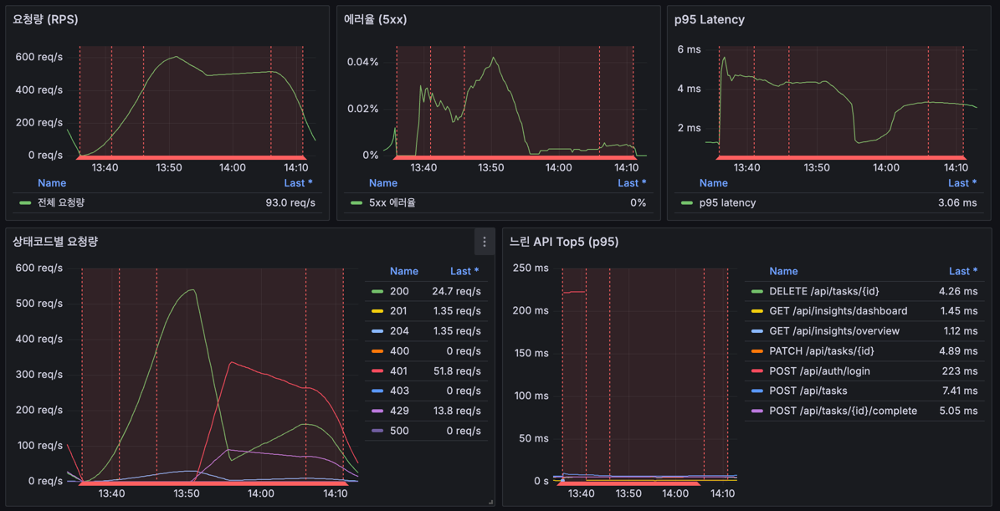
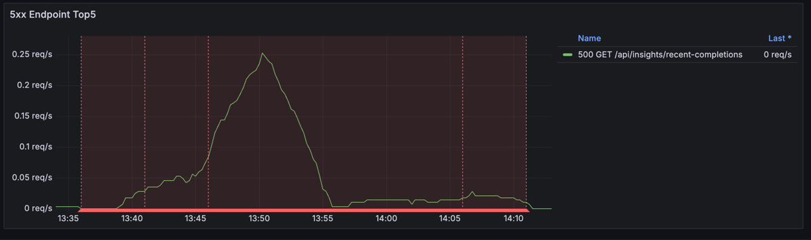

# Local Mixed Peak 부하테스트 결과 정리

본 문서는 `infra/load/results/local-mixed-peak-20260517-043551` 실행 결과를 기준으로 작성한 성능 분석 보고서입니다.

## 1) 한눈에 보는 결론

- 이번 실행은 `mixed-peak` 시나리오(`0→20→50 VU`, `50 VU 20분 유지`, `50→0 VU`)를 끝까지 수행했습니다.
- 처리량은 `최대 약 600 req/s`, 평균 `415.59 req/s`까지 상승하며 부하 곡선은 시나리오와 정합적으로 움직였습니다.
- 다만 품질 지표는 안정 기준을 충족하지 못했습니다.
  - `http_req_failed = 45.42%`
  - `checks 성공률 = 51.37%`
- Grafana에서도 동일하게 `401`, `429`가 피크 구간에서 크게 증가했고, 일부 `500`이 `GET /api/insights/recent-completions`에 집중되었습니다.
- 즉, 이번 mixed 테스트의 결론은 **"완주 성공"이지만 "운영 안정성 합격"은 아님**입니다.

## 2) 테스트 개요

### 2.1 실행 시각 (KST)

`case-env.txt` 기준 시작 시각:
- 시작: `2026-05-17 13:35:55 KST`

이번 결과 폴더에는 `FINISHED_AT`가 기록되지 않았으므로, 시나리오 길이(`35분`) 기준으로 종료 시각을 계산하면:
- 종료(계산): `2026-05-17 14:10:55 KST`

단계 경계:
- `13:35:55 ~ 13:40:55`: `0 → 20 VU` (5분)
- `13:40:55 ~ 13:45:55`: `20 → 50 VU` (5분)
- `13:45:55 ~ 14:05:55`: `50 VU 유지` (20분)
- `14:05:55 ~ 14:10:55`: `50 → 0 VU` (5분)

### 2.2 실행 환경

| 항목 | 값 |
|---|---|
| CPU | AMD Ryzen 5 PRO 6650H |
| Memory | 16GB |
| Storage | 512GB SSD |
| 대상 URL | `http://127.0.0.1:3000` |
| k6 스크립트 | `infra/load/k6-auth-mixed-peak-local.js` |
| 혼합비 | read:write = `70:30` (`WRITE_RATIO_PERCENT=30`) |

### 2.3 시나리오 동작 방식

- 각 iteration마다 랜덤 분기:
  - `30%`: write flow (`create -> update -> complete -> delete`)
  - `70%`: read flow (`tasks/insights` 중심 batch)
- `sleep(0.5s)` 적용
- 인증은 `setup()` 초기 로그인 + 만료 시 재로그인(`RELOGIN_ON_401=true`)

## 3) Grafana 캡처

### 3.1 대시보드 종합

### 3.2 5xx Endpoint Top5

## 4) 핵심 수치 요약 (k6 summary)

| 지표 | 값 |
|---|---:|
| 총 요청 수 (`http_reqs.count`) | 872,832 |
| 평균 RPS (`http_reqs.rate`) | 415.59 req/s |
| 총 iterations | 160,038 |
| 전체 avg latency | 1.78 ms |
| 전체 p95 latency | 4.10 ms |
| 전체 p99 latency | 6.02 ms |
| 전체 max latency | 1219.76 ms |
| HTTP 실패율 (`http_req_failed`) | 45.42% |
| checks 성공률 | 51.37% |

### 4.1 flow 기준 latency

| Metric | Count | avg | p95 | p99 | max |
|---|---:|---:|---:|---:|---:|
| `http_req_duration{flow:read}` | 669,508 | 1.46 ms | 2.53 ms | 3.31 ms | 269.82 ms |
| `http_req_duration{flow:write}` | 118,484 | 3.90 ms | 6.47 ms | 8.56 ms | 1219.76 ms |

### 4.2 endpoint 기준 p95 (요약)

| Endpoint | Count | p95 |
|---|---:|---:|
| `tasks_due_now` | 112,042 | 2.60 ms |
| `tasks_upcoming` | 112,042 | 2.61 ms |
| `insights_dashboard` | 112,042 | 2.64 ms |
| `insights_overview` | 112,042 | 2.59 ms |
| `insights_recent` | 112,042 | 2.53 ms |
| `task_create` | 47,996 | 7.55 ms |
| `task_update` | 23,496 | 5.88 ms |
| `task_complete` | 23,496 | 5.92 ms |

## 5) 그래프 기반 인사이트

### 5.1 요청량(RPS)

- `0→20→50 VU` 구간에서 RPS가 빠르게 증가하여 피크 `~600 req/s`에 도달했습니다.
- `50 VU 유지` 구간에서 `~500 req/s` 내외로 유지되다가, ramp-down에 맞춰 하강했습니다.
- 시나리오 단계 변화와 RPS 곡선은 전반적으로 일치합니다.

### 5.2 에러율(5xx)

- 전체 5xx 비율은 매우 낮은 수준(그래프 축 기준 `0.04%` 피크 근처)입니다.
- 그러나 "5xx가 낮다"는 사실만으로 안정적이라고 볼 수는 없습니다.
- 실제 실패의 주원인은 5xx보다 `401`, `429`였습니다.

### 5.3 p95 latency

- p95는 대부분 `3~5ms` 수준으로 낮게 보입니다.
- 하지만 이 구간에는 `401/429` 빠른 실패 응답이 많이 섞여 있어, latency 수치가 좋아 보여도 성공률이 낮을 수 있습니다.
- 따라서 mixed 테스트에서는 latency와 함께 `status code 분포`, `http_req_failed`, `checks`를 반드시 같이 봐야 합니다.

### 5.4 상태코드 분포

대시보드에서 확인된 핵심 패턴:
- 정상 응답(200 계열) 비중이 피크 구간에서 감소
- 동시에 `401`이 큰 비중으로 상승
- `429`도 동반 상승
- `500`은 소량

해석:
- 서버 처리 성능 자체보다 인증/보호 정책 구간에서 먼저 병목이 발생한 흐름입니다.

### 5.5 5xx Endpoint Top5

- `500 GET /api/insights/recent-completions`가 관찰되며, 피크 시점은 대략 `13:50` 전후입니다.
- 절대량은 낮지만, 특정 endpoint로 모여 나타난다는 점에서 원인 추적 대상입니다.

## 6) 오류 원인 추정 및 해결 방안 (현재 결과 기준)

이번 문단은 `k6 summary`, `Grafana 캡처`, `실행 스크립트/설정`만으로 추론한 내용입니다.

### 6.1 1순위 원인: 재로그인 폭주로 인한 인증 병목 (`401/429`)

핵심 근거:

| Check | Passes | Fails |
|---|---:|---:|
| `auth bootstrap: status 200` | 25 | 84,814 |
| `tasks_due_now: status 200` | 54,649 | 57,393 |
| `tasks_upcoming: status 200` | 54,649 | 57,393 |
| `insights_recent: status 200` | 54,529 | 57,513 |
| `task_create: status 201` | 23,496 | 24,500 |

추론 체인:
- 혼합 시나리오는 `RELOGIN_ON_401=true` 상태에서 토큰 만료 시 재로그인을 시도함
- 동일 시점에 다수 VU가 로그인 재시도를 수행하면 인증 API로 순간 트래픽이 집중됨
- 이때 rate-limit 정책(IP, IP+email)에 먼저 걸리며 `429` 발생
- 재로그인 실패 VU가 만료/무효 토큰으로 API를 계속 호출하면서 `401`이 확산
- 결과적으로 `http_req_failed(45.42%)`, `checks 성공률(51.37%)`이 크게 악화

해결 방안:
1. 계정 샤딩: 단일 계정이 아니라 계정 풀을 준비하고 VU별로 고정 배정
2. 재로그인 분산: 만료 시점 이전 랜덤 jitter를 두어 동시 재로그인 분산
3. 재시도 제어: 재로그인에 exponential backoff + jitter + 최대 시도 횟수 적용
4. 테스트 전용 rate-limit 프로파일: 부하 테스트 시 한시적으로 인증 한도 상향 또는 분리 정책 적용

### 6.2 2순위 원인: mixed write가 실패 비율을 추가로 확대

핵심 근거:
- `task_create` 실패가 `24,500건`으로 매우 큼
- 반면 `create` 성공 후 이어지는 `update/complete/delete`는 실패가 거의 없음

해석:
- write 흐름 자체의 비즈니스 로직 결함보다, `create` 진입 시점의 인증 실패(`401/429`)가 주된 실패원인일 가능성이 높음
- 즉 write 기능의 처리 성능보다 "인증 상태"가 먼저 깨져 write 성공률을 끌어내린 패턴

해결 방안:
1. write 경로 합격기준 분리: 기능 성공률과 인증 실패율을 별도 지표로 분리 평가
2. 시나리오 2단계화: 인증 안정화 시나리오와 read/write 혼합 시나리오를 분리 실행

### 6.3 3순위 원인 후보: `GET /api/insights/recent-completions`의 간헐 500

관측 사실:
- Grafana `5xx Endpoint Top5`에 `500 GET /api/insights/recent-completions`가 표시됨
- 따라서 500은 "실제로 발생"한 것으로 보고 원인 가설을 수립해야 함
- 다만 현재 보관 데이터만으로는 예외 클래스(스택트레이스)까지 확정 불가

#### 500 발생 가능 로직 (코드 경로 기준)

1. mixed read 호출
- k6 read flow가 `GET /api/insights/recent-completions`를 지속 호출

2. 서버 처리 경로
- `TaskInsightsController.getRecentCompletions()`
- `TaskService.findRecentCompletions()`
- `taskCompletionRepository.findTop5ByUserIdOrderByCompletedAtDesc(userId)` 조회 후
- 응답 매핑에서 `completion.getTask().getId()/getName()` 접근

3. 동시성 충돌 가능 지점
- mixed write flow는 같은 사이클에서 `create -> complete -> delete`를 수행
- `TaskCompletion.task`가 LAZY 로딩이라서, 목록 조회 쿼리와 `task` 로딩 쿼리가 분리됨
- 이 사이에 다른 트랜잭션이 task를 삭제하면, 연관 엔티티 로딩 시점에 ORM 예외가 발생할 수 있음
- 이 예외가 글로벌 핸들러의 catch-all(`Exception`)로 들어가면 최종 응답이 500이 됨

4. 추가 가능성 (쿼리 압력)
- `recent-completions`는 1회 요청당 기본 조회 + lazy 후속 조회(N+1 가능)가 발생할 수 있음
- 고RPS 구간에서 DB 연결/쿼리 압력이 순간적으로 높아지면 일시적 500이 표면화될 수 있음

#### 500 원인 가설 매트릭스

| 우선순위 | 가설 | 왜 가능한가 (현재 근거) | 예방/완화 방안 |
|---:|---|---|---|
| 1 | read-write 경합 중 ORM 조회 예외 | mixed 시나리오에서 write는 `create->update->complete->delete`, read는 `recent-completions`를 지속 조회. `recent-completions` 응답 매핑 시 `completion.getTask()` lazy 접근이 발생하므로, 삭제/조회 타이밍 경합 시 ORM 예외 가능성이 있음 | `recent-completions`를 fetch join/projection 기반 단일 조회로 변경, lazy 후속 조회 제거 |
| 2 | 인증 폭주에 따른 2차 자원 스파이크 | 같은 구간에서 `401/429`가 대량 발생했고 재로그인 실패가 매우 큼. 인증 병목이 app/db 자원에 순간 스파이크를 만들면 일부 요청이 500으로 표면화될 수 있음 | 재로그인 backoff+jitter, 계정 샤딩, auth rate-limit 테스트 프로파일 분리 |
| 3 | 미분류 런타임 예외가 공통 500으로 귀결 | 현재 글로벌 핸들러는 특정 예외 외에는 `Exception`으로 받아 500 처리. 간헐 예외가 발생하면 상세 코드 없이 동일한 500으로 수렴 | `DataAccessException`/`EntityNotFoundException`/`JpaObjectRetrievalFailureException` 등 세분 핸들러 추가 |

#### 코드 레벨 근거 포인트

1. 문제 endpoint 경로
- `GET /api/insights/recent-completions` -> `taskService.findRecentCompletions()`

2. 응답 매핑 시 연관 엔티티 접근
- `RecentTaskCompletionResponse` 생성 과정에서 `completion.getTask().getId()/getName()` 접근

3. mixed write 흐름의 삭제 동작
- write flow에서 task 생성 후 완료 후 삭제까지 수행

위 2-3이 동시에 고부하에서 반복되면, 간헐적인 ORM/DB 예외가 500으로 관측될 수 있는 구조입니다.

#### 500 추적 강화 계획 (다음 실행부터)

1. requestId 기반 500 샘플 자동 수집
- 테스트 종료 직후 `status=500` access log와 동일 `requestId`의 stack trace를 함께 저장
- 결과 폴더(`infra/load/results/...`)에 `500-trace.log`를 자동 생성

2. 예외 유형 메트릭 태깅
- `INTERNAL_ERROR`를 한 종류로 보지 않고 `exception class` 태그 단위로 집계
- Grafana에 `5xx by exception`, `5xx by endpoint+exception` 패널 추가

3. endpoint 정밀 계측
- `recent-completions` 단독 p95/p99, 5xx rate, DB query count(가능하면) 별도 패널로 분리
- mixed 단계(20VU ramp, 50VU hold, ramp-down)와 겹쳐서 원인 시점을 좁힘

4. 로그 보존 강화
- 현재 Docker 로그 회전 용량이 작아 사후 추적이 어려움
- 테스트 구간에는 API 로그 보존량 상향 또는 로그 파일 즉시 아카이브 적용

### 6.4 정리

- 이번 실패를 분류하면 크게 `401/429`와 `500`으로 나뉩니다.
- `401/429`는 `인증 트래픽 제어`가 주요 원인으로 보입니다.
- `500` 소량 발생하였습니다. `동시성 충돌`이 원인으로 보이나, 현재 어플리케이션 로그 보존이 되지 않아 예외 클래스단위의 확정이 불가능합니다.
- 다음 실행에서는 500을 예외 클래스 단위로 확정할 수 있도록 관측 체계를 먼저 강화하는 것이 최우선입니다.

### 6.5 우선순위 산정 기준 

정량 근거:
- 전체 요청 실패율: `http_req_failed = 45.42%` (`476,433 / 872,832`)
- checks 성공률: `51.37%`
- 다수 endpoint에서 200/201 체크 실패가 수만 건 단위로 동시 발생 (`401/429` 축)
- 반면 Grafana 5xx 피크는 약 `0.04%` 수준

해석:
- 현재 실패 총량은 `401/429`가 압도적으로 큽니다(주 실패원인).
- `500`은 빈도는 낮지만 "정상적이지 않은 서버 예외"이므로 수정 대상입니다.

우선순위:
1. `P0`: 인증 실패 대량 구간(`401/429`) 안정화
2. `P1`: `recent-completions` 500 원인 확정 및 코드 수정 (fetch 전략/예외 처리)
3. `P2`: 관측성 강화(예외 클래스 태깅, 자동 로그 아카이브)

## 7) 이번 실행의 의미

- 장점:
  - mixed 시나리오를 실제로 완주했고, 단계별 부하 패턴 재현이 가능함을 확인
  - RPS/지연/상태코드/5xx endpoint를 한 번에 연동해 관측 가능한 상태를 확보
- 한계:
  - 현재 설정에서는 인증 재시도/제한정책 구간이 mixed 안정성의 병목으로 확인됨
  - 따라서 "read API 성능"과 "운영 안정성"을 동일선상에서 해석하면 왜곡될 수 있음

## 8) 우선 개선 로드맵

1. `P0` 즉시(테스트 스크립트/정책 레벨)
- 계정 풀 기반 VU 매핑
- 재로그인 jitter/backoff 적용
- 재로그인 실패 시 연쇄 요청 제어(짧은 cool-off)
- 부하테스트 프로파일에서 auth rate-limit 별도 값 운용
- 인증 실패(`401/429`)를 endpoint/phase별로 분리 대시보드화

2. `P1` 단기(애플리케이션 로직 레벨)
- `recent-completions`를 fetch join/projection으로 전환해 lazy 경합 창 축소
- `DataAccessException`/`EntityNotFoundException` 계열을 분리 핸들링해 원인 코드 가시화

3. `P2` 중기(관측성 레벨)
- 5xx requestId 샘플 자동 수집
- `recent-completions` 예외 유형을 태깅해서 패널로 집계
- 테스트 시작/종료 시점 로그 자동 보관으로 사후 분석 정확도 개선

4. 합격 기준 재정의
- latency 단독이 아니라 `성공률`, `http_req_failed`, `401/429 비중`, `5xx 절대건수`를 동시 충족 조건으로 설정

## 9) 원본 데이터 위치

- 실행 루트: `infra/load/results/local-mixed-peak-20260517-043551`
- k6 요약: `mixed-peak/summary.json`
- 요약 테이블: `k6-summary.tsv`, `k6-summary.txt`
- 실행 환경: `test-env.txt`, `mixed-peak/case-env.txt`
- Grafana 캡처: `grafana-mixed-peak-overview.png`, `grafana-mixed-peak-5xx-endpoint-top5.png`

## 10) 결과 해석 주의

- `summary.json`의 `thresholds` boolean은 본 결과에서도 직관과 다르게 보일 수 있습니다.
- 최종 판단은 아래 실측값 기반으로 진행했습니다.
  - `http_req_failed.value`
  - `checks.value`
  - endpoint별 `p95`
  - Grafana 상태코드/에러 시계열
