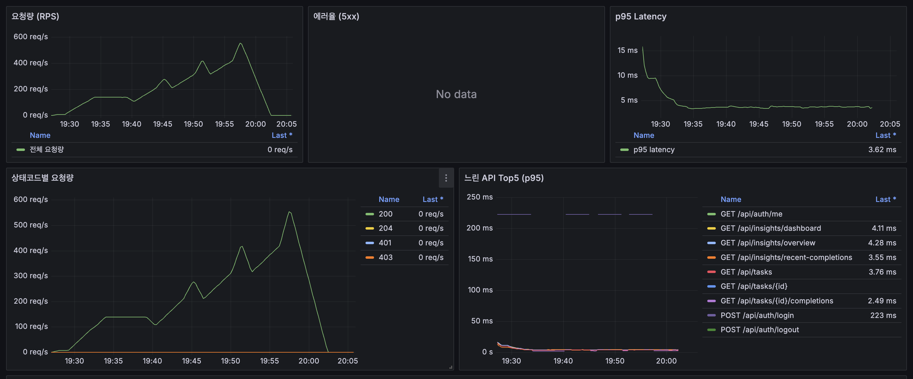

# Local Read Matrix 부하테스트 결과 정리

본 문서는 `infra/load/results/local-read-matrix-20260512-102647` 실행 결과를 바탕으로 작성한 성능 검증 보고서입니다.

## 1) 한눈에 보는 결론

- 이번 로컬 테스트에서 시스템은 `80 VU`까지 **거의 선형적으로 처리량이 증가**했습니다.
- 최고 부하(`80 VU`)에서도 전체 `p95`는 약 `8.11ms`, 실패율(`http_req_failed`)은 `0%`로 안정적입니다.
- 다만 `60/80 VU` 구간에서 `max`가 `~1.0~1.1s`로 튀는 **희귀 tail latency**가 보입니다. 평균/`p95`는 안정적이므로, 빈도는 낮지만 원인 분석 가치는 큽니다.

## 2) 테스트 개요

### 2.1 언제 실행했나 (KST)

| Case | 시작 | 종료 |
|---|---|---|
| smoke-vus5-1m | 2026-05-12 19:26:52 | 2026-05-12 19:28:00 |
| baseline-vus20-10m | 2026-05-12 19:29:00 | 2026-05-12 19:39:09 |
| step-vus40-5m | 2026-05-12 19:40:09 | 2026-05-12 19:45:18 |
| step-vus60-5m | 2026-05-12 19:46:18 | 2026-05-12 19:51:28 |
| step-vus80-5m | 2026-05-12 19:52:28 | 2026-05-12 19:57:37 |

스크린샷의 시계열(19:26~20:05)과 위 구간이 잘 맞습니다.

### 2.2 테스트 대상/스크립트

- 대상 URL: `http://127.0.0.1:3000`
- k6 스크립트: `infra/load/k6-auth-read-local.js`
- 인증: `setup()`에서 로그인 후 토큰 발급(`RELOGIN_ON_401=true`)

### 2.3 실행 환경

| 항목 | 값 |
|---|---|
| CPU | AMD Ryzen 5 PRO 6650H |
| Memory | 16GB |
| Storage | 512GB SSD |
| OS | Linux Ubuntu (`6.8.0-107-generic`) |
| Container Runtime | Docker (api, db, web, prometheus, grafana) |

### 2.4 Grafana 스냅샷

### 2.5 시나리오(한 iteration 기준)

한 번의 iteration에서 기본적으로 아래 7개 GET을 호출합니다.

1. `GET /api/tasks?status=DUE_NOW`
2. `GET /api/tasks?status=UPCOMING`
3. `GET /api/insights/dashboard`
4. `GET /api/insights/overview?days=30&top=5`
5. `GET /api/insights/recent-completions`
6. `GET /api/tasks/{id}`
7. `GET /api/tasks/{id}/completions?year=YYYY&month=MM`

그리고 iteration 끝에 `sleep(1)`이 들어갑니다.

## 3) 핵심 지표 정의

| 지표 | 의미 | 이번 문서에서 보는 포인트 |
|---|---|---|
| `VUs` | 동시에 동작하는 가상 사용자 수 | 부하 강도 자체 |
| `iterations` | 스크립트 루프 실행 횟수 | 시나리오 수행량 |
| `http_reqs` | 총 HTTP 요청 수 | 실제 요청량 |
| `RPS` (`http_reqs.rate`) | 초당 요청 수 | 처리량(Throughput) |
| `http_req_duration` | 요청-응답 전체 시간(ms) | 성능 핵심 지표 |
| `avg` | 평균 지연시간 | 전반적 체감 |
| `p95` | 상위 5%를 제외한 95% 요청의 지연시간 | 안정성/서비스 품질 |
| `p99` | 상위 1%를 제외한 지연시간 | tail 성능 |
| `max` | 단일 최악 지연시간 | 스파이크/이상치 탐지 |
| `http_req_failed` | HTTP 실패 비율 | 오류 안정성 |
| `checks` | 응답 상태/본문 검증 성공률 | 기능적 정상 여부 |

### 지연 지표 해석 기준

- 평균(`avg`)만 보면 일부 느린 요청이 가려집니다.
- `p95`는 서비스의 일반적 응답 품질을 안정적으로 보여줍니다.
- `max`는 극단값이라 노이즈가 있을 수 있어, `p95/p99`와 함께 봐야 의미가 생깁니다.

## 4) 케이스별 핵심 결과

| Case | VU | Duration | HTTP req count | Avg RPS | avg(ms) | p95(ms) | p99(ms) | max(ms) | 실패율 |
|---|---:|---|---:|---:|---:|---:|---:|---:|---:|
| smoke-vus5-1m | 5 | 1m | 2,101 | 34.37 | 6.35 | 13.52 | 19.21 | 223.58 | 0% |
| baseline-vus20-10m | 20 | 10m | 83,245 | 138.54 | 3.95 | 7.58 | 10.18 | 219.01 | 0% |
| step-vus40-5m | 40 | 5m | 83,413 | 276.92 | 3.68 | 7.82 | 10.92 | 221.90 | 0% |
| step-vus60-5m | 60 | 5m | 124,965 | 414.88 | 4.06 | 7.91 | 12.20 | 1103.02 | 0% |
| step-vus80-5m | 80 | 5m | 166,643 | 553.22 | 4.14 | 8.11 | 12.17 | 1025.40 | 0% |

총 요청 수: `460,367`

### 4.1 엔드포인트별 p95 추세 (20VU vs 80VU)

| Endpoint | p95 @20VU | p95 @80VU | 변화 |
|---|---:|---:|---:|
| insights_dashboard | 8.14ms | 8.87ms | +0.73ms |
| insights_overview | 8.14ms | 8.67ms | +0.53ms |
| insights_recent | 7.62ms | 8.31ms | +0.69ms |
| tasks_due_now | 7.89ms | 8.52ms | +0.63ms |
| tasks_upcoming | 7.89ms | 8.42ms | +0.53ms |
| task_detail | 4.16ms | 5.63ms | +1.47ms |
| task_completions_monthly | 4.25ms | 5.79ms | +1.54ms |

해석:
- 모든 endpoint가 `80VU`에서도 한 자리 ms(또는 낮은 두 자리 ms) 수준의 p95를 유지합니다.
- 절대값은 여전히 빠르며, `task_detail`/`task_completions_monthly`는 증가폭이 상대적으로 커서 추세 관찰 대상입니다.

## 5) 데이터에서 바로 읽히는 인사이트

### 5.1 처리량은 선형 확장에 가깝다

- `20 VU → 80 VU`에서 VU는 `4.0x`, RPS는 `138.54 → 553.22 (3.99x)`로 증가했습니다.
- 즉, 이 구간에서는 병목으로 인한 급격한 처리량 저하가 보이지 않습니다.

### 5.2 지연시간 증가는 매우 완만하다

- `20 VU → 80 VU`에서:
- `avg`: `3.95ms → 4.14ms` (`+4.79%`)
- `p95`: `7.58ms → 8.11ms` (`+7.06%`)
- `p99`: `10.18ms → 12.17ms` (`+19.45%`)

해석:
- 평균/`p95` 기준으로는 매우 안정적입니다.
- `p99` 증가폭이 상대적으로 큰 것은 tail에서 압력이 조금 올라간 신호입니다.

### 5.3 1초대 스파이크는 “희귀하지만 존재”

- `step-vus60-5m` max: `1103ms`
- `step-vus80-5m` max: `1025ms`

동시에 `p99`가 `~12ms` 수준이라는 점을 보면, **아주 일부 요청만 크게 튀는 패턴**입니다.  
즉, 시스템이 전반적으로 느려진 것이 아니라 순간적인 큐잉/락/GC/DB wait 같은 이벤트가 개입했을 가능성이 큽니다.

### 5.4 Smoke 케이스가 오히려 느린 이유

`smoke-vus5-1m`에서 `p95 13.52ms`로 가장 느립니다. 이는 흔한 패턴입니다.

- 워밍업(JIT, 캐시 미스) 영향
- 측정 기간이 짧아 초기 구간 비중이 큼
- 샘플 수가 적어 통계 변동성이 큼

실서비스 판단은 `baseline/step` 구간을 우선 보는 것이 맞습니다.

### 5.5 엔드포인트별 특성

`80 VU` 기준 `p95`:

- `insights_dashboard`: `8.87ms`
- `insights_overview`: `8.67ms`
- `tasks_due_now`: `8.52ms`
- `tasks_upcoming`: `8.42ms`
- `insights_recent`: `8.31ms`
- `task_completions_monthly`: `5.79ms`
- `task_detail`: `5.63ms`

해석:
- 이번 시나리오에서는 `insights_*` 계열이 상대적으로 무겁습니다.
- 그래도 절대값은 매우 낮아(두 자리 ms 미만) 현재 구간에서는 여유가 있습니다.

### 5.6 요청량 계산 검증(모델 일관성)

`요청 수 ≒ iterations × 7 + setup 로그인 1회`

예시:
- `baseline`: `11,892 × 7 + 1 = 83,245` (실측과 일치)
- `step-80`: `23,806 × 7 + 1 = 166,643` (실측과 일치)

이 검증은 “테스트 스크립트가 의도대로 동작했는가”를 확인하는 데 중요합니다.

### 5.7 메모리 관점(스냅샷 기반)

API 컨테이너 메모리(`task-reloader-api`)는 아래 흐름을 보였습니다.

- 시작 전: `430.2MiB`
- 최종(80VU 종료 후): `666.0MiB` (`+235.8MiB`, `+54.8%`)

케이스별 증분:
- smoke: `+91.0MiB`
- baseline: `+153.2MiB`
- step40: `+18.2MiB`
- step60: `+15.8MiB`
- step80: `+7.5MiB`

해석:
- 초반 워밍업/캐시 적재로 크게 오르고, 이후에는 증가 폭이 줄어드는 패턴입니다.
- 다만 연속 시계열(Heap/GC) 없이 before/after 스냅샷만으로 메모리 누수 단정은 어렵습니다.

## 6) Grafana 스크린샷과의 연결 해석

### 6.1 요청량(RPS)

- 그래프 피크가 약 `550 req/s`이고, k6 `step-vus80-5m`의 `553.22 req/s`와 거의 일치합니다.
- 부하 단계 전환(`20→40→60→80`)에 맞춰 계단형 상승이 보입니다.

### 6.2 에러율(5xx)

- 패널에 `No data`로 보입니다.
- 보통은 “5xx 시계열이 없거나 0에 수렴”으로 해석합니다.
- 최종적으로 k6 `http_req_failed=0%`이므로 기능 실패는 관측되지 않았습니다.

### 6.3 p95 Latency

- 초반 `~15ms`에서 빠르게 내려가 `~3.5~4ms` 근처로 안정화됩니다.
- 워밍업 후 안정화 패턴으로 볼 수 있습니다.

### 6.4 상태코드별 요청량

- `200`이 지배적입니다.
- `204/401/403` 라인이 보이더라도 종료 시점 Last는 `0 req/s`입니다.
- k6 체크(상태/본문) 실패가 0이므로 주 시나리오 성공 흐름에는 영향이 없었습니다.

### 6.5 느린 API Top5 (p95)

- `POST /api/auth/login`의 `p95 ~223ms`가 눈에 띄지만,
- 로그인 요청은 호출 빈도가 낮을 수 있어(샘플 수가 적으면) p95 해석 시 주의가 필요합니다.
- 실제 트래픽의 대부분을 차지하는 read API들의 p95는 `~2.5~4.3ms`대로 매우 낮았습니다.

## 7) 권고 점검 영역 (우선순위)

1. `P1` tail latency(1초대) 원인 추적  
`step-vus60/80` 구간에서 발생한 max 스파이크의 원인을 `p99.9`, GC pause, DB wait와 시간 정렬해 확인하는 것을 권장합니다.

2. `P1` 고부하 구간의 인증/권한 응답 코드 분포  
`401/403` 발생 시점 및 endpoint별 count를 별도 집계해, 관측 노이즈와 실제 이슈를 구분할 필요가 있습니다.

3. `P2` insights 계열 쿼리 최적화 여지  
현재 절대 지연은 낮지만 상대적으로 무거운 그룹이므로, 데이터 증가 전에 선제 점검을 권장합니다.

4. `P2` 메모리 안정성 장기 관찰  
스냅샷 기반 분석에는 한계가 있으므로, 장시간 soak 테스트와 heap/GC 시계열 병행 수집을 권장합니다.

## 8) 수치 해석 요약

- 평균(`avg`)이 좋아도 `p95/p99`가 나쁘면 실제 체감은 나쁠 수 있습니다.
- `max` 하나만 보고 성능이 나쁘다고 판단하지 않습니다.
- 실패율 0%라도 tail spike가 크면 사용자 민원 포인트가 될 수 있습니다.
- 부하 증가 대비 RPS가 선형이면 확장성은 우수한 편입니다.
- 이번 결과는 “**현재 데이터/환경에서 read API는 매우 안정적**”이라는 근거가 됩니다.

## 9) 원본 데이터 위치

- 결과 루트: `infra/load/results/local-read-matrix-20260512-102647`
- 케이스별 요약: `*/summary.json`
- 케이스 설정: `*/case-env.txt`
- 시스템/컨테이너 스냅샷 파일: `system.txt`, `memory.txt`, `docker-ps.txt`, `docker-stats-app-before-all.txt`, `*/docker-stats-app-before.txt`, `*/docker-stats-app-after.txt`

## 10) 결과 해석 시 주의할 점

- `summary.json` 안의 `thresholds` 불리언 값만으로 pass/fail을 단정하지 마세요.
- 이번 데이터에서는 `thresholds`가 `false`로 보이더라도, 실측 지표(`http_req_failed=0`, `checks=100%`, endpoint p95가 임계치보다 충분히 낮음)는 기준을 만족합니다.
- 실무에서는 반드시 아래를 같이 확인하세요.
1. k6 종료 코드(프로세스 exit code)
2. 콘솔 summary 출력
3. `summary.json`의 실제 수치값(`p95`, `http_req_failed`, `checks`)

## 11) 후속 계획 문서

- k6 후속 테스트 계획: `k6-next-test-plan.md`
- Grafana 대시보드 확장 권고: `grafana-dashboard-expansion.md`
