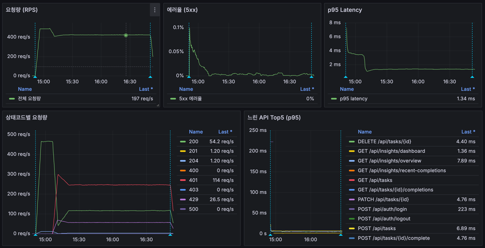
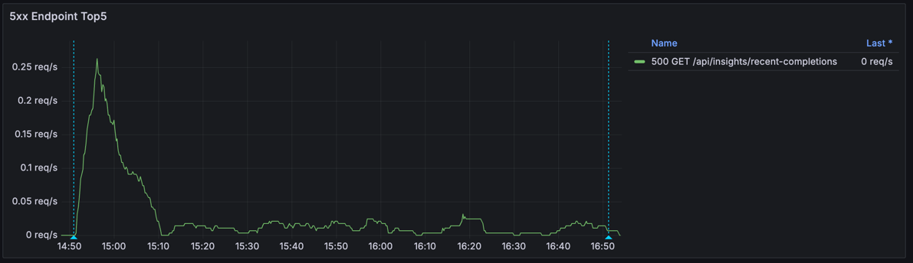

# Local Soak 부하테스트 결과 정리

본 문서는 `infra/load/results/local-soak-20260517-055109` 실행 결과를 기준으로 작성한 성능 분석 보고서입니다.

## 1) 한눈에 보는 결론

- 이번 실행은 `soak-steady` 시나리오(`60 VU`, `2h`, `read/write=85:15`)를 완료했습니다.
- 처리량과 지연은 장시간 구간에서 안정적입니다.
  - 평균 처리량 `431.61 req/s`
  - 전체 `p95 3.57ms`, 전체 `p99 5.42ms`
- 다만 품질 지표는 기준을 충족하지 못했습니다.
  - `http_req_failed = 62.33%`
  - `checks 성공률 = 35.30%`
- Grafana 기준으로 `401/429`가 장시간 유지되며 실패를 주도했고, `500`은 소량이지만 `GET /api/insights/recent-completions`에 집중되었습니다.
- 결론적으로 이번 soak는 **지연 안정성 확인에는 유의미**하지만, **성공률/인증 안정성 관점에서는 미합격**입니다.

## 2) 테스트 개요

### 2.1 실행 시각 (KST)

`case-env.txt` 기준 시작:
- 시작: `2026-05-17 14:51:13 KST`

`SOAK_DURATION=2h` 기준 종료(계산):
- 종료(계산): `2026-05-17 16:51:13 KST`

### 2.2 실행 환경

| 항목 | 값 |
|---|---|
| CPU | AMD Ryzen 5 PRO 6650H |
| Memory | 16GB |
| Storage | 512GB SSD |
| 대상 URL | `http://127.0.0.1:3000` |
| k6 스크립트 | `infra/load/k6-auth-soak-local.js` |
| 시나리오 | `60 VU`, `2h`, `WRITE_RATIO_PERCENT=15`, `SLEEP_SECONDS=0.8` |

### 2.3 시나리오 동작 방식

- 각 iteration마다 랜덤 분기:
  - `15%`: write flow (`create -> update -> complete -> delete`)
  - `85%`: read flow (`tasks/insights` 중심 batch)
- 인증은 `setup()` 초기 로그인 + 만료 시 재로그인(`RELOGIN_ON_401=true`)

## 3) Grafana 캡처

### 3.1 대시보드 종합

### 3.2 5xx Endpoint Top5

## 4) 핵심 수치 요약 (k6 summary)

| 지표 | 값 |
|---|---:|
| 총 요청 수 (`http_reqs.count`) | 3,108,003 |
| 평균 RPS (`http_reqs.rate`) | 431.61 req/s |
| 총 iterations | 536,591 |
| 전체 avg latency | 1.72 ms |
| 전체 p95 latency | 3.57 ms |
| 전체 p99 latency | 5.42 ms |
| 전체 max latency | 1288.36 ms |
| HTTP 실패율 (`http_req_failed`) | 62.33% |
| checks 성공률 | 35.30% |
| 동시 사용자 (`vus_max`) | 60 |

### 4.1 flow 기준 latency

| Metric | Count | avg | p95 | p99 | max |
|---|---:|---:|---:|---:|---:|
| `http_req_duration{flow:read}` | 2,582,730 | 1.65 ms | 2.97 ms | 4.10 ms | 73.77 ms |
| `http_req_duration{flow:write}` | 161,971 | 3.61 ms | 7.09 ms | 8.98 ms | 1288.36 ms |

### 4.2 endpoint 기준 p95 (요약)

| Endpoint | Count | p95 |
|---|---:|---:|
| `tasks_due_now` | 455,824 | 3.00 ms |
| `tasks_upcoming` | 455,824 | 3.05 ms |
| `insights_dashboard` | 455,824 | 3.07 ms |
| `insights_overview` | 455,824 | 3.05 ms |
| `insights_recent` | 455,824 | 3.02 ms |
| `task_create` | 80,767 | 8.09 ms |
| `task_update` | 27,068 | 5.82 ms |
| `task_complete` | 27,068 | 5.86 ms |

## 5) 그래프 기반 인사이트

### 5.1 요청량(RPS)

- 시작 직후 `~460 req/s` 수준까지 빠르게 상승하고, 이후 장시간 `~410 req/s` 내외로 유지됩니다.
- 종료 시점 근처에서 급감하는 패턴은 soak 종료에 따른 자연스러운 하강으로 해석됩니다.
- 즉, 처리량 자체는 장시간 구간에서 큰 드리프트 없이 유지되었습니다.

### 5.2 에러율(5xx)

- 5xx 비율은 시작 구간에서 일시적으로 높았다가 빠르게 하락했고, 이후는 낮은 수준을 유지했습니다.
- 절대량은 작지만, endpoint 집중도가 확인되어(아래 5.5) 원인 추적 대상입니다.

### 5.3 p95 latency

- 시작 구간에서 `~8ms` 근처였다가 빠르게 `~1.3~1.5ms`대로 안정화되었습니다.
- 장시간 soak에서 latency 드리프트가 크지 않았다는 점은 긍정적입니다.
- 다만 본 실행은 실패 응답(`401/429`) 비중이 높아 latency 단독 해석은 위험합니다.

### 5.4 상태코드 분포

상태코드 패널 기준 특징:
- `401`이 장시간 높은 수준으로 유지
- `429`도 유의미한 수준으로 지속
- `200`은 상대적으로 낮은 비중
- `500`은 소량

패널 마지막 시점(`Last*`) 예시:
- `200`: `54.2 req/s`
- `401`: `114 req/s`
- `429`: `26.5 req/s`

해석:
- soak에서의 주 실패 원인은 처리 성능 저하가 아니라 인증/보호정책 구간(`401/429`)입니다.

### 5.5 5xx Endpoint Top5

- `500 GET /api/insights/recent-completions` 단일 endpoint가 관찰됩니다.
- 시작 구간(`~14:55 KST`)에 피크가 있고, 이후에는 낮은 수준의 간헐 패턴이 반복됩니다.
- 소량이더라도 서버 예외이므로 우선순위를 별도 관리해 수정 대상으로 유지해야 합니다.

## 6) 실패 패턴 분석 (k6 check 기준)

체크 집계에서 인증 관련 실패가 매우 크게 나타납니다.

| Check | Passes | Fails | Fail Ratio |
|---|---:|---:|---:|
| `auth bootstrap: status 200` | 110 | 363,191 | 99.97% |
| `tasks_due_now: status 200` | 151,805 | 304,019 | 66.70% |
| `tasks_upcoming: status 200` | 151,805 | 304,019 | 66.70% |
| `insights_recent: status 200` | 151,601 | 304,223 | 66.74% |
| `task_create: status 201` | 27,068 | 53,699 | 66.49% |

반면, `task_create` 성공 이후 단계(`update/complete/delete`)는 실패가 거의 없습니다.

해석:
- 핵심 병목은 비즈니스 로직보다 인증 상태 유지/재인증 흐름입니다.
- 인증 실패가 누적되면서 read/write 전체의 성공률이 함께 악화된 패턴입니다.

## 7) 원인 추정 및 우선순위

### 7.1 원인 추정

1. 재로그인 동시성으로 인한 인증 병목
- 장시간 실행 중 다수 VU가 비슷한 시점에 토큰 갱신을 시도하면서 로그인 API 집중
- rate-limit 경계에서 `429` 증가
- 재로그인 실패 후 `401`이 연쇄 증가

2. `recent-completions`의 간헐 500
- Grafana에서 반복 관측되며, low-frequency라도 서버 예외로 분류해야 함
- mixed와 동일하게 read/write 경합 + 연관조회 타이밍 이슈 가능성이 존재

### 7.2 우선순위

1. `P0`: `401/429` 대량 실패 안정화  
2. `P1`: `recent-completions` 500 원인 확정 및 코드 수정  
3. `P2`: 예외 추적/로그 보존/대시보드 세분화

## 8) 개선 포인트

1. 인증 안정화
- 계정 풀 샤딩, 재로그인 jitter/backoff, 실패 연쇄 억제(cool-off)
- 부하테스트 전용 auth rate-limit 프로파일 분리

2. 500 추적/수정
- `recent-completions` 조회 경로를 projection/fetch join 기반으로 단순화
- 예외를 클래스 단위로 분리 계측하고 5xx 패널에서 endpoint+exception으로 추적

3. 합격 기준 재정의
- latency만이 아니라 `성공률`, `http_req_failed`, `401/429 비중`, `5xx 절대건수`를 동시 기준으로 평가

## 9) 원본 데이터 위치

- 실행 루트: `infra/load/results/local-soak-20260517-055109`
- k6 요약: `soak-steady/summary.json`
- 실행 환경: `test-env.txt`, `soak-steady/case-env.txt`
- Grafana 캡처: `grafana-soak-overview.png`, `grafana-soak-5xx-endpoint-top5.png`

## 10) 결과 해석 주의

- `summary.json`의 threshold boolean은 실제 실패율과 불일치해 보일 수 있습니다.
- 최종 판단은 아래 실측값 기반으로 수행했습니다.
  - `http_req_failed.value`
  - `checks.value`
  - endpoint별 `p95`
  - Grafana 상태코드/에러 시계열
