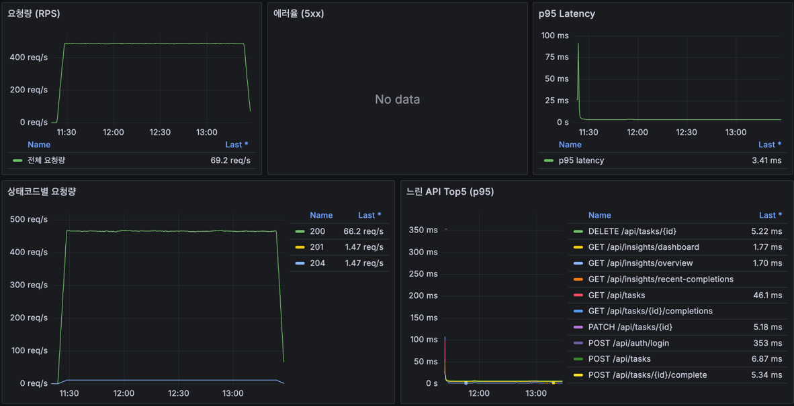
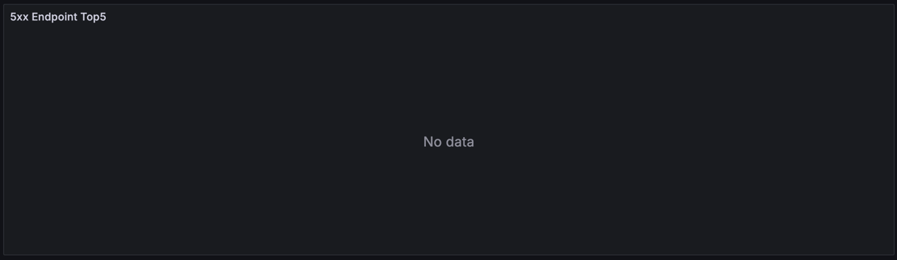

# Fixed Token Soak Load Test Result

## Summary

이번 테스트는 `GET /api/insights/overview`의 projection 리팩터링 이후, 인증 재로그인과 rate-limit 변수를 제거한 상태에서 API가 장시간 steady load를 안정적으로 처리하는지 확인하기 위해 수행했다.

결론적으로 60 VU, 2시간 지속 부하에서 전체 요청 3,507,776건을 처리했고, k6 기준 실패율은 0%, check 성공률은 100%, API/DB 로그 기준 5xx/500/401/429는 모두 0건이었다.

## Why This Test Was Run

이전 mixed 부하테스트에서는 인증 재로그인, rate-limit, `recent-completions` lazy loading 문제가 차례로 드러났다. 이후 고정 access token으로 인증 변수를 제거했고, `recent-completions`와 `today-completions`는 DTO projection으로 전환했다.

이번 테스트의 초점은 다음 세 가지였다.

1. `overview` projection 리팩터링 이후에도 인사이트 API가 장시간 부하에서 안정적인지 확인한다.
2. 짧은 peak 테스트가 아니라 2시간 동안 일정한 부하를 유지해 지연 증가, 에러 누적, 리소스 증가 같은 장시간 운영 리스크를 본다.
3. 고정 access token을 사용해 인증 재시도와 rate-limit 영향을 배제하고, API 처리 로직 자체의 안정성을 분리해서 확인한다.

## Test Environment

| Item | Value |
| --- | --- |
| Result directory | `infra/load/results/local-soak-fixed-token-20260531-022322` |
| Scenario | `soak-steady` |
| Script | `infra/load/k6-auth-soak-local.js` |
| Base URL | `http://127.0.0.1:3000` |
| Server CPU | Ryzen 5 PRO 6650H |
| Server Memory | 16GB |
| Server Storage | 512GB SSD |
| OS | Ubuntu Linux 6.8.0-107-generic |
| Authentication | Pre-issued fixed access token |
| Relogin on 401 | `false` |

## Load Pattern

| Item | Value |
| --- | --- |
| VUs | 60 |
| Duration | 2h |
| Actual k6 window | `2026-05-31T02:23:26Z` ~ `2026-05-31T04:23:37Z` |
| Actual duration | 7,211 sec |
| Iterations | 535,565 |
| Iteration rate | 74.38 iter/s |
| Configured write ratio | 15% |
| Observed read iterations | 455,172 |
| Observed write iterations | 80,393 |

The scenario is a steady-state soak test. Unlike peak tests, this does not try to find the maximum breaking point. It keeps a realistic mixed workload running for a long period and checks whether latency, errors, or resource usage gradually degrade.

## Traffic Mix

Each read iteration executes the main read API batch.

| Flow | Endpoint |
| --- | --- |
| Read | `GET /api/tasks?status=DUE_NOW` |
| Read | `GET /api/tasks?status=UPCOMING` |
| Read | `GET /api/insights/dashboard` |
| Read | `GET /api/insights/overview?days=30&top=5` |
| Read | `GET /api/insights/recent-completions` |
| Read | `GET /api/tasks/{id}` |
| Read | `GET /api/tasks/{id}/completions?year=YYYY&month=MM` |

Each write iteration creates a task, updates it, completes it, and deletes it.

| Flow | Endpoint |
| --- | --- |
| Write | `POST /api/tasks` |
| Write | `PATCH /api/tasks/{id}` |
| Write | `POST /api/tasks/{id}/complete` |
| Write | `DELETE /api/tasks/{id}` |

Iteration 기준으로는 write가 약 15%다. 요청 수 기준으로는 read flow가 3,186,204건, write flow가 321,572건으로 집계된다. 이는 write iteration이 read iteration보다 요청 수가 적고, read iteration에는 상세/완료 이력 조회까지 포함되기 때문이다.

## k6 Result

| Metric | Value |
| --- | ---: |
| Total requests | 3,507,776 |
| Average RPS | 487.14 req/s |
| Average latency | 1.91 ms |
| p95 latency | 4.08 ms |
| p99 latency | 6.09 ms |
| Max latency | 1,436.87 ms |
| Failed request rate | 0% |
| Check success rate | 100% |

`max latency`에 1초 이상 outlier가 있었지만, p95/p99가 각각 4.08ms/6.09ms로 유지되었다. 즉, 일부 순간적인 긴 응답은 있었으나 대부분의 요청은 매우 낮은 지연으로 처리되었다.

## Flow Latency

| Flow | Requests | Avg | p95 | p99 | Max |
| --- | ---: | ---: | ---: | ---: | ---: |
| Read | 3,186,204 | 1.64 ms | 2.77 ms | 4.00 ms | 1,189.53 ms |
| Write | 321,572 | 4.61 ms | 6.73 ms | 8.65 ms | 1,436.87 ms |

write flow는 DB insert/update/delete가 포함되기 때문에 read flow보다 느리다. 그래도 write p95가 6.73ms 수준이므로, 이번 부하에서는 쓰기 작업도 안정적인 범위 안에 있었다.

## Endpoint Latency

| Endpoint tag | Requests | Avg | p95 | p99 | Max |
| --- | ---: | ---: | ---: | ---: | ---: |
| `insights_dashboard` | 455,172 | 2.00 ms | 3.05 ms | 4.39 ms | 1,137.91 ms |
| `insights_overview` | 455,172 | 2.01 ms | 3.06 ms | 4.40 ms | 1,182.16 ms |
| `insights_recent` | 455,172 | 1.79 ms | 2.81 ms | 4.04 ms | 1,189.53 ms |
| `tasks_due_now` | 455,172 | 1.83 ms | 2.88 ms | 4.10 ms | 1,177.65 ms |
| `tasks_upcoming` | 455,172 | 1.83 ms | 2.87 ms | 4.10 ms | 1,171.39 ms |
| `task_create` | 80,393 | 5.65 ms | 8.18 ms | 9.83 ms | 1,436.87 ms |
| `task_update` | 80,393 | 4.27 ms | 5.94 ms | 6.76 ms | 241.33 ms |
| `task_complete` | 80,393 | 4.43 ms | 5.99 ms | 6.95 ms | 86.37 ms |

`insights_overview`는 이번 테스트의 핵심 관찰 대상이었다. projection 리팩터링 이후에도 455,172회 호출에서 p95 3.06ms, p99 4.40ms로 안정적이었다. 이는 `overview` 계산이 장시간 혼합 부하에서도 병목으로 드러나지 않았다는 의미다.

## Grafana Overview

Grafana에서는 약 2시간 동안 RPS가 480~490 req/s 수준으로 유지되는 것을 확인할 수 있다. 캡처 끝부분의 RPS 하락은 테스트 종료 시점이 포함되었기 때문에 나타난 정상적인 감소다.

5xx 에러율 패널은 `No data`로 표시된다. 이 대시보드에서는 5xx가 발생하지 않으면 시계열 자체가 생성되지 않기 때문에, `No data`는 이번 테스트 구간에서 5xx가 없었다는 의미로 해석한다.

p95 latency는 초반 시작 구간에서 짧은 spike가 있었지만 이후 낮은 수준으로 안정화되었다. 장시간 유지 구간에서 지속적으로 latency가 상승하는 패턴은 보이지 않는다.

상태코드별 요청량은 `200`, `201`, `204`가 관찰된다.

- `200`: 조회, 수정, 완료 등 성공 응답
- `201`: task 생성 성공
- `204`: task 삭제 성공

`401`, `429`, `500` 계열이 보이지 않는 점은 고정 token 기반 부하에서 인증/rate-limit/서버 내부 예외가 재발하지 않았다는 근거다.

## 5xx Endpoint Top5

5xx Endpoint Top5도 `No data`로 표시된다. 자동 추출된 Docker 로그에서도 5xx access log, 500 access log, 5xx requestId, DB error line이 모두 0건이었다.

| Log item | Count |
| --- | ---: |
| 5xx access lines | 0 |
| 500 access lines | 0 |
| 401/429 access lines | 0 |
| 5xx request IDs | 0 |
| DB error lines | 0 |

## Resource Snapshot

| Container | Before memory | After memory | Note |
| --- | ---: | ---: | --- |
| `task-reloader-web` | 9.87 MiB | 10.53 MiB | 변화 작음 |
| `task-reloader-api` | 429.8 MiB | 721.9 MiB | 2시간 부하 후 증가 |
| `task-reloader-db` | 42.62 MiB | 52.7 MiB | 변화 작음 |
| `task-reloader-prometheus` | 59.39 MiB | 59.95 MiB | 변화 작음 |
| `task-reloader-grafana` | 47.25 MiB | 47.3 MiB | 변화 작음 |

API 컨테이너 메모리는 테스트 전후 snapshot 기준으로 증가했다. 이번 결과에서는 에러나 latency 악화로 이어지지는 않았지만, snapshot만으로는 정상적인 JVM heap 확장인지, 장시간 누수 가능성인지 구분할 수 없다. 후속 테스트에서는 JVM heap, GC pause, process memory를 시간축 패널로 추가해 보는 것이 좋다.

## Interpretation

이번 soak 테스트는 "최대 처리량 한계"를 찾는 테스트가 아니라, 정해진 수준의 혼합 부하를 장시간 유지했을 때 서비스가 안정적으로 버티는지 확인하는 테스트다.

테스트 결과는 다음을 보여준다.

- 60 VU, 2시간, 평균 487 RPS 수준에서 API는 실패 없이 응답했다.
- `recent-completions`에서 관찰되던 500은 재발하지 않았다.
- `overview` projection 리팩터링 이후에도 인사이트 API는 낮은 p95/p99를 유지했다.
- 고정 access token 조건에서는 401/429가 발생하지 않아 인증 재시도와 rate-limit 변수가 제거되었다.
- read/write 혼합 시나리오에서도 쓰기 API의 p95가 한 자리 ms 수준으로 유지되었다.

따라서 이번 테스트의 의미는 "현재 홈서버 로컬 환경에서, 인증 변수를 제거한 혼합 read/write 부하를 2시간 지속했을 때 API 처리 로직과 DB 접근 패턴은 안정적으로 동작했다"는 것이다.

## Limitations

이번 결과만으로 운영 안정성을 완전히 증명했다고 보기는 어렵다.

- 고정 access token을 사용했기 때문에 로그인, refresh, token 만료, 재로그인 폭주는 검증 대상에서 제외되었다.
- 단일 홈서버 로컬 환경이므로 네트워크 지연, 외부 프록시, 실제 사용자 분포는 반영되지 않았다.
- 2시간 soak로는 단기 안정성은 확인할 수 있지만, 하루 이상 누적되는 메모리/커넥션/디스크 문제까지 보장하지는 않는다.
- Docker stats는 before/after snapshot이라 중간 구간의 메모리 최고점이나 GC 패턴을 설명하기 어렵다.

## Next Steps

1. JVM/DB 관측 패널 추가
   API heap used/committed, GC pause, active DB connections, slow query count를 Grafana에 추가하면 API 컨테이너 메모리 증가의 의미를 더 정확히 볼 수 있다.

2. 장시간 soak 확장
   같은 조건으로 4~6시간 또는 야간 테스트를 실행하면 메모리 증가가 안정화되는지, 누적되는지 확인할 수 있다.

3. 인증 안정화 테스트 분리
   고정 token이 아닌 login/refresh/token 만료 조건을 별도 시나리오로 분리해 인증 계층의 안정성을 검증한다.

## Related Files

- k6 summary: `soak-steady/summary.json`
- k6 compact summary: `k6-summary.txt`
- test window: `k6-run-window.txt`
- case env: `soak-steady/case-env.txt`
- log summary: `soak-steady/log-extract/500-summary.md`
